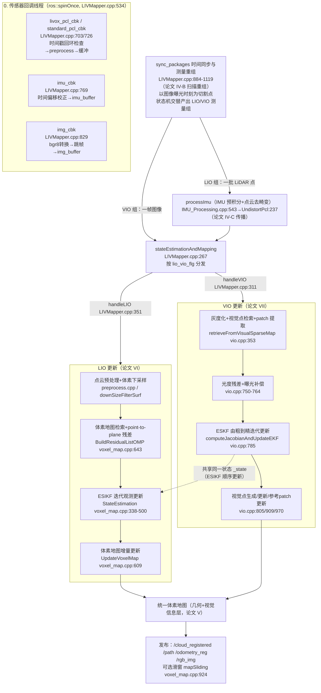
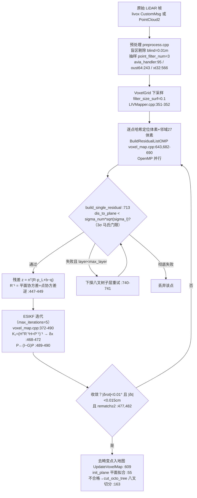
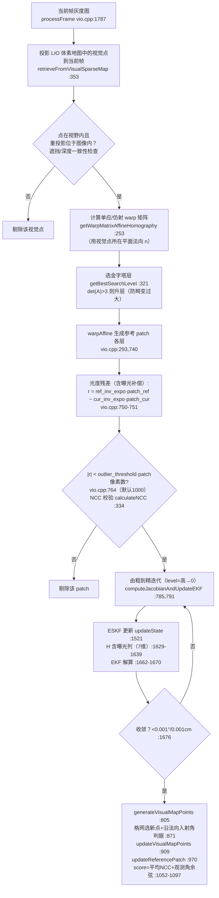

# FAST-LIVO2 论文-代码对照：数据处理流程详解

> 论文：*FAST-LIVO2: Fast, Direct LiDAR-Inertial-Visual Odometry*（arXiv 2408.14035v2，本地 `2408.14035v2.pdf`）
> 代码：`/root/catkin_ws/src/FAST-LIVO2`（WSL，hku-mars 官方实现，commit 0d2c034）
> 本文按数据流顺序，对每个步骤回答五个问题：**怎么做、怎么计算（公式）、用什么计算（代码位置）、如何判断（判据）、判断依据（为什么）**。

---

## 一、总流程图

**关键架构事实**：单线程主循环 + 回调线程；LIO 与 VIO 通过 `lio_vio_flg` 状态机在时间轴上**严格串行交替**执行，共享同一个 `StatesGroup _state`——这正是论文 III 节"ESIKF 顺序状态更新"（先 LiDAR 后视觉，避免信息重复使用）的实现方式（LIVMapper.cpp:946-1075）。

---

## 二、LIO 子流程细化图（论文 IV-B/IV-C/VI + 代码）

## 三、VIO 子流程细化图（论文 V-C/V-D/VII + 代码）

---

## 四、逐步骤详解

### 步骤 ① 数据同步与测量重组（论文 IV-B Scan Recondensation）

- **怎么做**：`sync_packages()`（LIVMapper.cpp:884-1119）维护三个缓冲区，以**图像曝光时刻**（`img_time + exposure_time_init`，:953）为切割点，把 LiDAR 点流按时间切成属于"上一个 LIO 组"（`pcl_proc_cur`）和"下一个组"（`pcl_proc_next`）（:1010-1033），并用状态机 `lio_vio_flg` 在 LIO/VIO 之间切换（:946-1075）。
- **怎么计算**：逐点比较点时间戳与切割时刻，拼接近邻的 IMU 区间 `[last_update_time, prop_end_time]`。
- **用什么计算**：`LIVMapper.cpp` 的 `sync_packages`；缓冲互斥锁 `mtx_buffer`。
- **如何判断**：时间戳回环（新<旧）的帧直接丢弃（:703 附近检查）；缓冲不足则本循环不处理。
- **判断依据**：论文 IV-B 指出 LiDAR 帧内点非同时刻产生（卷帘效应），必须重组为"以图像时刻为界的测量组"，才能让 ESIKF 的每次更新对应严格的时间点，保证顺序更新的马尔可夫性。

### 步骤 ② IMU 预积分与点云去畸变（论文 IV-C Propagation）

- **怎么做**：`ImuProcess::Process2`（IMU_Processing.cpp:543）→ `UndistortPcl`（:237）。前向：对区间内每个 IMU 做中值积分传播状态与协方差（:334-341，去偏置、重力归一 :352-353；协方差传播 F_x/cov_w :382-401，曝光噪声在 cov_w(6,6) :395）；保存每时刻 IMUpose（:430）。反向：用区间末端状态把每个点从其采集时刻位姿反变换到末端位姿（~:490-535），消除帧内运动畸变。
- **怎么计算**：中值积分 `R_{k+1}=R_k·Exp(ω·dt/2)·...`；误差状态协方差 `P ← F P Fᵀ + Q`。
- **用什么计算**：Eigen；状态定义 `StatesGroup`（include/common_lib.h:126-222）。
- **如何判断**：静止初始化 `IMU_init`（:104）要求首几帧平均加速度模接近重力才收敛重力方向；无 IMU 时走 `Forward_without_imu`（:151）。
- **判断依据**：IMU 是唯一的高频运动先验；论文 IV-C 给出传播方程即为 ESIKF 预测步，去畸变是 LIO 残差在统一位姿下计算的前提。

### 步骤 ③ LiDAR 点云预处理

- **怎么做**：`preprocess.cpp` 按雷达型号分发（avia:95 / oust64:243 / velodyne:346 / xt32:566 / robosense:710）。
- **怎么计算**：盲区剔除（距传感器 < blind=0.01m）、每 `point_filter_num=3` 个点取 1、Livox 路径按 `point_filter_num` 抽样（:188-190），robosense 含 NaN 剔除（:727）。
- **用什么计算**：`p_pre->process()`（在回调内调用）。
- **如何判断**：仅几何距离/索引过滤，无概率判据。
- **判断依据**：近点多为机身/噪声；抽样在不损失配准精度的前提下降低残差构建成本（论文实验节效率分析）。

### 步骤 ④ 体素地图构建与增量更新（论文 V-A/V-B）

- **怎么做**：数据结构 `VoxelOctoTree`（include/voxel_map.h）。首帧 `BuildVoxelMap`（voxel_map.cpp:532），之后 `UpdateVoxelMap`（:609）。每个新点哈希进体素（voxel_size=0.5m），`UpdateOctoTree`（:219）触发 `init_plane`（:55-135）重新拟合。
- **怎么计算**：平面拟合=体素内点协方差特征分解：**法向 n = 最小特征值对应的特征向量**（:113）；同时闭式计算平面参数的 6×6 协方差 `plane_var_`（:88-111，论文式 (12)-(14)，用于给残差加权）。
- **如何判断**（三重判据）：
  1. **平面有效**：`min_eigen_value < planer_threshold_`（默认 0.01，:86）——最小特征值小 ⟺ 点集中在一张平面；
  2. **不平面则切分**：`cut_octo_tree`（:163）递归八叉切分，每层起判点数 `layer_init_num=[5,5,5,5,5]`（:180）；
  3. **平面饱和冻结**：点数 > `max_points_num=50`（:146）置 `update_enable_=false`，停止吸收新点。
- **判断依据**：论文 V-B 的分层结构把"大而平"与"小而碎"的几何分别用粗体素和细层表达；特征值判据是平面度（planarity）的标准概率度量；冻结饱和平面避免老平面主导、让新区域也能建平面（遗忘机制）。
- **鲁棒化实现说明**（补齐常见误解）：FAST-LIVO2 的 LiDAR 鲁棒化**不是**论文公式里的截断最小二乘求解器，而是"马氏 3σ 剔除 + R 按方差自适应加权"（见步骤⑤⑥）；论文 TLS 描述与代码实现存在此差异。

### 步骤 ⑤ LIO 残差：point-to-plane + 噪声建模（论文 VI）

- **怎么做**：`BuildResidualListOMP`（voxel_map.cpp:643）对每个去畸变点：哈希定位所在体素并检索 27 邻域（:682-690），取出平面 (q, n, 平面协方差)，调 `build_single_residual`（:713-786）。
- **怎么计算**：残差 `z = nᵀ ( R · p_body + b − q )`（:725，论文式 (26)）；量测协方差 `R = R_plane + R_point`，其中点协方差由 `calcBodyCov`（:15）按 **光束发散角 beam_err 与深度误差 dept_err** 离散化为 3×3（论文 VI-B 式 (27)-(29)：距离越远、入射角越大，切向方差越大）。
- **如何判断**：`dis_to_plane < sigma_num * sqrt(sigma_l)`（:737，sigma_num=3）马氏门限；失败则按层下探八叉子层用更细平面重试（:740-741），到 max_layer 仍失败则丢弃。
- **判断依据**：3σ 门限即论文的 outlier 剔除（把遮挡点/动态物体判为外点）；按层下探保证在平面边缘和碎几何处仍能找到有效约束；方向相关噪声建模是 FAST-LIVO2 相对 FAST-LIO 的精度提升点之一。

### 步骤 ⑥ LIO ESIKF 迭代观测更新（论文 IV-D）

- **怎么做**：`VoxelMapManager::StateEstimation`（voxel_map.cpp:338-500），迭代 EKF（max_iterations=5，:372），每次迭代用当前状态**重新配准**（re-match，:482-485 要求至少 rematch 2 次防早退）。
- **怎么计算**：H 取 6 维误差状态子空间（旋转+平移，:409-456）；增益 `K₁=(Hᵀ R⁻¹ H + P⁻¹)⁻¹`，`δx = K₁(Hᵀ R⁻¹ z) + (vec − G·vec)`（:468-472；即论文式 (11) 的代码形态）；协方差收缩 `P ← (I−G)P`（:489-490）。
- **用什么计算**：Eigen 矩阵运算；残差构建 OpenMP 并行。
- **如何判断（收敛判据）**：旋转增量 < 0.01° 且平移增量 < 0.015cm（:477）→ 停止迭代。
- **判断依据**：迭代卡尔曼在高初始误差下等价于对非线性量测反复线性化（论文 IV-D）；P 的收缩保证后续 VIO 更新使用的先验协方差正确；代码中 H 特征值退化检测被注释（:467），实际依赖残差数量与体素分布间接保证可观性（论文 IX-C 的实验退化分析）。

### 步骤 ⑦ VIO：视觉点检索与 patch 提取（论文 V-C/VII-A）

- **怎么做**：`retrieveFromVisualSparseMap`（vio.cpp:353-780）。把 LIO 体素地图中带视觉信息的 3D 点投影到当前帧，对每个点：
  1. `getWarpMatrixAffineHomography`（:253）用**该点所在平面的法向 n**（来自 LIO！）计算参考帧→当前帧的单应，简化为局部仿射 `A`；
  2. `getBestSearchLevel`（:321）选金字塔层：`det(A)>3` 升层（最大 2 层）；
  3. `warpAffine`（:293）对每层（0..patch_pyrimid_level−1=4）生成对齐后的参考 patch（patch_size=8）。
- **怎么计算**：单应 `H = K(r − (t·nᵀ)/d)K⁻¹` 的局部一阶近似（论文式 (32)-(34)）；patch 内逐像素双线性插值。
- **用什么计算**：OpenCV `cv::warpAffine`/插值；金字塔 `buildPyramid`。
- **如何判断**：重投影出界/深度不一致/视角角 > 80° 的点剔除（文档 3 的 7.2.3 判据表）；warp 后 `calculateNCC`（:334）做相似度校验。
- **判断依据**：LiDAR 提供的平面法向使图像 patch 可以按真实 3D 姿态扭曲，是 FAST-LIVO2"直接法也能处理大视角变化"的核心（论文 V-C）；金字塔层选择以仿射畸变度（行列式）为尺度依据。

### 步骤 ⑧ 光度残差与曝光补偿（论文 VII-B 式 (35)-(37)）

- **怎么做**：对每个有效 patch 计算带曝光修正的光度残差（vio.cpp:750-751）：
  `r = ref_pt->inv_expo_time · I_ref(warp) − state.inv_expo_time · I_cur`
- **怎么计算**：曝光时间 t_e 作为状态的第 19 维（`inv_expo_time`，StatesGroup:126），两帧各自的光度按各自逆曝光缩放后再作差，消除自动曝光引起的整体亮度漂移；曝光自身的过程噪声进入 cov_w(6,6)（IMU_Processing.cpp:395）。
- **如何判断（外点剔除）**：`|r| > outlier_threshold × patch总像素数`（:764，默认 1000）剔除该 patch。
- **判断依据**：把曝光建模为状态量使残差在亮度突变（如开关灯、室内外切换，Bright_Screen_Wall 序列正是此场景）下仍零偏；阈值以"patch 总光度误差"为尺度而非单像素，对 patch 尺寸鲁棒。

### 步骤 ⑨ VIO ESKF 更新（论文 IV-D 视觉实例化）

- **怎么做**：`computeJacobianAndUpdateEKF`（vio.cpp:785）**由粗到精**（level 从最高层到 0，:791）迭代；`updateState`（:1521，H 为 7 维：6 位姿 + 1 曝光列，:1629-1639）或逆组合版本 `updateStateInverse`（:1399，H 为 6 维）。
- **怎么计算**：光度残差对位姿的雅可比 = 图像梯度 × 投影导数 × 旋转平移导数（链式，vio.cpp:1622 残差 / 雅可比解析式）；EKF 解算与 LIO 同公式（:1662-1670），量测噪声 `img_point_cov=100`；协方差 `cov −= G·cov`（:801）。
- **如何判断（收敛判据）**：旋转 < 0.001°、平移 < 0.001cm（:1676）。
- **判断依据**：粗到精是直接法标准做法（上层低频抑制局部极小）；曝光列进入 H 使位姿与曝光联合可观，避免亮度漂移被错误吸收进位姿。

### 步骤 ⑩ 视觉地图点生成与参考 patch 更新（论文 V-D）

- **怎么做**：更新完成后：
  - `generateVisualMapPoints`（:805）：在当前帧按格网挑新点，判据为**沿平面法向的入射角余弦**（:871，视角太平的点不要），生成新视觉点放入对应体素；
  - `updateVisualMapPoints`（:909）：按位移/像素距离更新既有视觉点的 patch；
  - `updateReferencePatch`（:970-1101）：对每个视觉点的**所有历史观测**打分。
- **怎么计算（参考帧选择评分）**：`score = 平均NCC（:1063-1086）+ 观测角余弦项（:1052,:1088）`，取最大者设为 `pt->ref_patch`（:1092-1097）；含平面法向更新判据（:1023）。
- **判断依据**：参考 patch 决定后续直接法对齐的模板；选"看得最正、质量最好"的历史观测作为参考可最大化 NCC 有效性、延缓模板老化（论文 V-D 的 reference patch update 机制，是 FAST-LIVO2 相对 R3LIVE 的主要改进之一）。

### 步骤 ⑪ 地图滑窗维护与发布

- **怎么做**：`mapSliding`（voxel_map.cpp:924）：`map_sliding_en=true` 时，机体位移超过 `sliding_thresh=8m` 则清除 `half_map_size=100m` 外的体素（`clearMemOutOfMap` :950）；发布 `/cloud_registered`、`/path`、`/odometry_reg`、`/rgb_img` 等。
- **如何判断**：以当前位姿到中心距离为判据。
- **判断依据**： bounding 内存增长，保证长序列可运行；对局部定位精度无影响（远处平面不再提供约束）。

---

## 五、附表

### 5.1 状态向量（StatesGroup，include/common_lib.h:126-222）

| 维度 | 分量 | 意义 |
|---|---|---|
| 0:3 | rot_end | 旋转（李代数 SO(3)） |
| 3:6 | pos_end | 世界系位置 |
| 6 | inv_expo_time | 逆曝光时间（VIO 光度补偿） |
| 7:10 | vel_end | 速度 |
| 10:13 | bias_g / 13:16 bias_a | IMU 偏置 |
| 16:19 | gravity | 重力 |

DIM_STATE=18；误差状态叠加规则见 operator+（common_lib.h:167-178）。

### 5.2 判据/阈值速查表

| 判据 | 代码位置 | 默认值 | 配置项 |
|---|---|---|---|
| LiDAR 残差 3σ 马氏门限 | voxel_map.cpp:737 | sigma_num=3 | 无（代码内） |
| 平面有效性 min_eigen_value | voxel_map.cpp:86 | 0.01 | lio.min_eigen_value |
| 八叉层起判点数 | voxel_map.cpp:139/180 | {5,5,5,5,5} | lio.layer_init_num |
| 平面饱和冻结 | voxel_map.cpp:146 | 50 | lio.max_points_num |
| ESIKF(LIO) 收敛 | voxel_map.cpp:477 | 0.01°/0.015cm | 无 |
| ESIKF(VIO) 收敛 | vio.cpp:1676 | 0.001°/0.001cm | 无 |
| VIO 外点阈值 | vio.cpp:764 | 1000 | vio.outlier_threshold |
| 视觉量测噪声 | vio.cpp:1498/1662 | 100 | vio.img_point_cov |
| 预处理盲区/抽样 | LIVMapper.cpp:88/93 | 0.01/3 | preprocess.blind / point_filter_num |
| 体素尺寸/最大层 | voxel_map.cpp:40-41 | 0.5/1 | lio.voxel_size / max_layer |
| 滑窗开关/半径/阈值 | voxel_map.cpp:50-52 | false/100/8 | local_map.* |

### 5.3 论文章节 ↔ 代码函数索引

| 论文章节 | 内容 | 代码位置 |
|---|---|---|
| III | 系统概述/顺序更新 | LIVMapper.cpp:267,946-1075 |
| IV-B | 扫描重组 | LIVMapper.cpp:884-1119 |
| IV-C | IMU 传播/去畸变 | IMU_Processing.cpp:237-535 |
| IV-D | ESIKF 更新 | voxel_map.cpp:468-490；vio.cpp:1662-1670 |
| V-A/V-B | 体素地图/分层平面 | voxel_map.cpp:55-235,532,609 |
| V-C | 视觉点生成/单应 warp | vio.cpp:253-334,805 |
| V-D | 参考块更新 | vio.cpp:970-1101 |
| VI-A | 点到平面测量模型 | voxel_map.cpp:713-786 |
| VI-B | 光束发散角噪声 | voxel_map.cpp:15-53 |
| VII-A | 地图点选择 | vio.cpp:353-780 |
| VII-B | 稀疏直接模型+曝光 | vio.cpp:750-764,1521-1670 |
