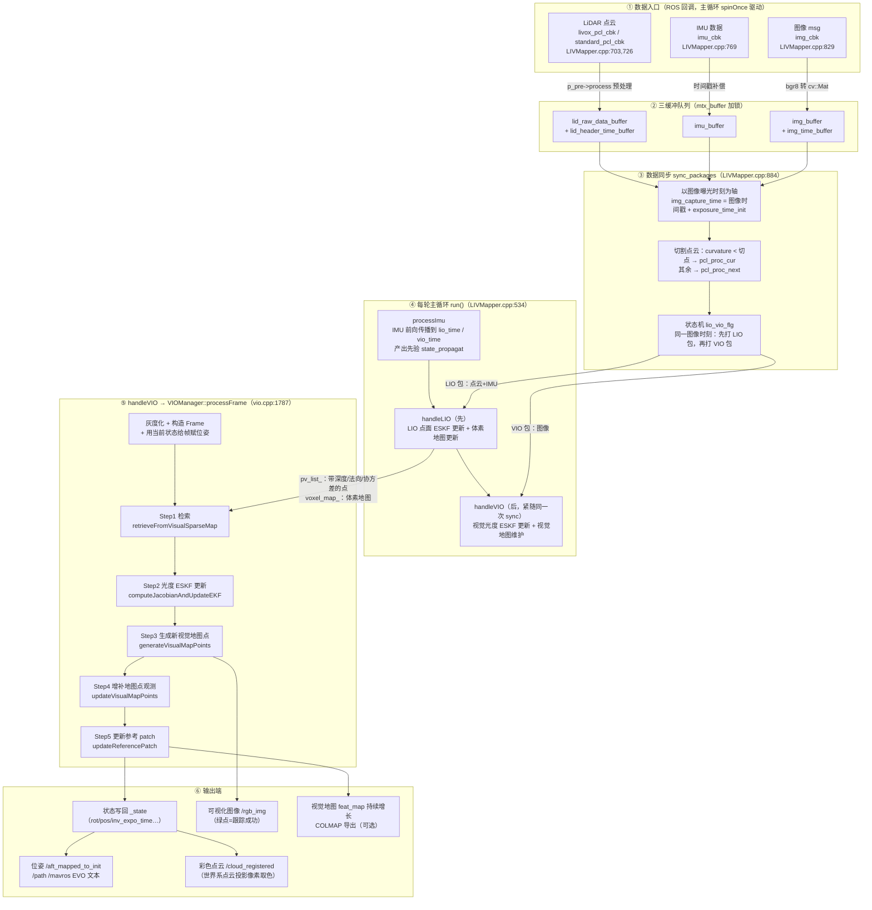
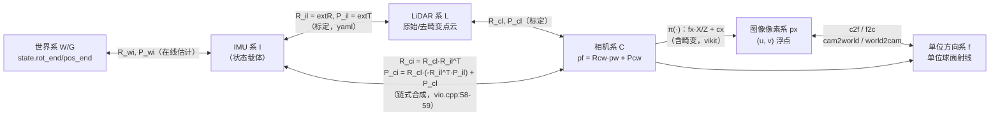
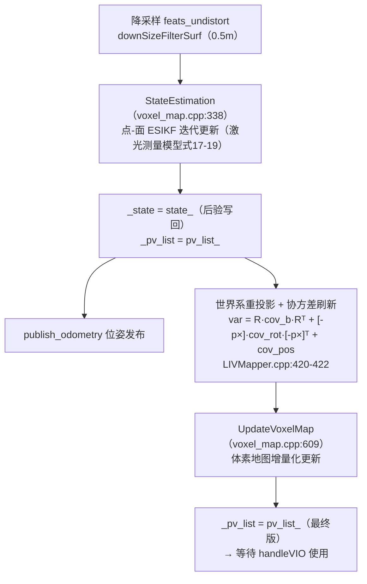
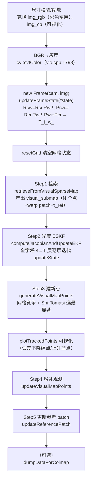
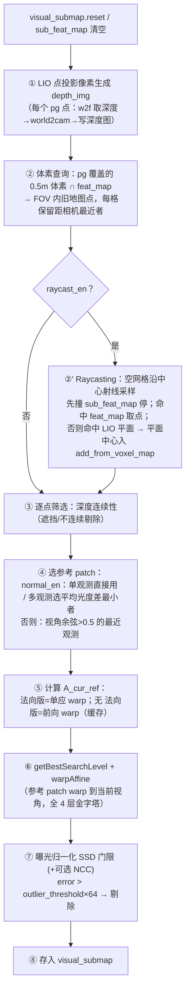

# FAST-LIVO2 视觉处理全流程图解
**——从图像数据进、到位姿与彩色点云出：流程图 · 公式 · 坐标系 · 数据结构 · 函数输入输出**

> 整理日期：2026-09-30
> 代码基准：本仓库 `FAST-LIVO2/`（ROS1 包，节点 `laserMapping`），所有行号以当前仓库代码为准。
> 论文公式编号对照《00_FAST-LIVO2 论文全文中文翻译（含代码实现说明附录）.md》（式(1)~(23)）。
>
> **本文关注的"视觉处理流程"** 指的是：图像消息进入系统后，如何被同步、如何借助 LiDAR/IMU 提供的先验、经过"检索 → 光度 ESKF 更新 → 建点 → 观测增补 → 参考 patch 更新"五步处理，最终写出状态（位姿）、更新视觉地图并输出彩色点云/可视化/位姿文件的完整过程。视觉部分与 LIO 深度耦合（深度、法向、协方差先验全部来自激光），因此 LIO 的"交接内容"也纳入梳理。

---

## 目录

1. [总览：端到端流程图](#1-总览端到端流程图)
2. [坐标系定义与变换链](#2-坐标系定义与变换链)
3. [核心数据结构定义](#3-核心数据结构定义)
4. [阶段一：数据入口与预处理](#4-阶段一数据入口与预处理)
5. [阶段二：IMU 先验传播](#5-阶段二imu-先验传播)
6. [阶段三：LIO 更新与视觉交接](#6-阶段三lio-更新与视觉交接)
7. [阶段四：processFrame 视觉处理核心五步](#7-阶段四processframe-视觉处理核心五步)
8. [阶段五：输出端](#8-阶段五输出端)
9. [公式总表（论文 ↔ 代码）](#9-公式总表论文--代码)
10. [参数速查](#10-参数速查)
11. [常见误解澄清（v1 vs v2）](#11-常见误解澄清v1-vs-v2)

---

## 1. 总览：端到端流程图

### 1.1 系统级总流程图



### 1.2 调度机制：LIO 与 VIO 为什么"背靠背"

- `sync_packages` 用状态机 `lio_vio_flg`（`EKF_STATE{WAIT, VIO, LIO, LO}`，common_lib.h:54-60）交替打包：
  - 上一次状态是 `WAIT/VIO` 时 → 打 **LIO 包**：`m.lio_time = img_capture_time`（LIVMapper.cpp:986），把 LiDAR 点按每点时间戳 `curvature`（毫秒）切到 `pcl_proc_cur`（本次用）与 `pcl_proc_next`（下帧用），并收集 `(last_lio_update_time, img_capture_time]` 内的 IMU 数据；返回后 `lio_vio_flg = LIO`。
  - 上一次状态是 `LIO` 时 → 打 **VIO 包**：`m.vio_time = img_capture_time`，`m.img = img_buffer.front()`（LIVMapper.cpp:1045-1074）；返回后 `lio_vio_flg = VIO`。
- 因此**每一个图像曝光时刻会触发两次 sync_packages**：第一次驱动 LIO 更新，第二次紧随其后驱动 VIO 更新。代码注释直白说明了设计意图："LIO first than VIO immediately"（LIVMapper.cpp:942-943）。
- 主循环 `run()`（LIVMapper.cpp:534-554）为**单线程**：`ros::spinOnce()` → `sync_packages` → `handleFirstFrame` → `processImu` → `stateEstimationAndMapping`。所谓"视觉线程"并不存在，视觉更新是在主循环中同步调用的（`switch (LidarMeasures.lio_vio_flg)` → `handleVIO()`，LIVMapper.cpp:267-279）。
- 唯一的额外定时器线程是 IMU 频率位姿输出 `imu_prop_timer`（4ms，LIVMapper.cpp:215），只做发布，不参与估计。

### 1.3 一帧图像的生命周期（速查）

| # | 时刻 | 动作 | 代码 |
|---|---|---|---|
| 1 | 采集 | 相机发布 `sensor_msgs/Image` | 驱动外部 |
| 2 | 回调 | `img_cbk`：时间戳补偿、过滤、转 BGR `cv::Mat` 入队 | LIVMapper.cpp:829-882 |
| 3 | 同步 | `sync_packages` 以 `img_capture_time` 切点云、配 IMU、挂图像 | LIVMapper.cpp:884-1119 |
| 4 | 传播 | `Process2` 把状态从上一更新时刻传播到 `vio_time` | IMU_Processing.cpp:543 |
| 5 | LIO 先行 | `StateEstimation` + `UpdateVoxelMap`，产出 `pv_list_` | voxel_map.cpp:338,609 |
| 6 | VIO 更新 | `processFrame` 五步（本文第 7 章主体） | vio.cpp:1787-1877 |
| 7 | 输出 | 状态落盘 `/ _state`，发布位姿、彩色点云、图像 | LIVMapper.cpp:305-333 |

---

## 2. 坐标系定义与变换链

### 2.1 六个坐标系

| 坐标系 | 记号 | 定义 | 代码体现 |
|---|---|---|---|
| **世界系 W**（=G） | `world` | 系统全局参考系；初始化时原点在第一帧 IMU 位置（重力对齐后 z 轴对准重力反方向） | `state.rot_end / pos_end` 注释 "world frame"（common_lib.h:215-216）；TF 树根 `camera_init` |
| **IMU 系 I**（=机体系） | `imu/body` | IMU 敏感轴坐标系，是**状态量的载体**：位姿、速度、零偏、重力都在此系参数化 | `StatesGroup`（common_lib.h:126-223） |
| **LiDAR 系 L** | `lidar` | 激光雷达原始点云坐标系；点云去畸变后输出仍在此系（`feats_undistort`） | `pointBodyToWorld`：`p_w = R_wi·(extR·p_L + extT) + p_wi`（LIVMapper.cpp:658） |
| **相机系 C** | `camera` | 相机光心为原点，z 轴沿光轴向前，x 向右、y 向下（标准针孔约定） | `pf = Rcw·p_w + Pcw`（vio.cpp:1574） |
| **图像像素系** | `px` | 像素平面，u 向右、v 向下，左上角为原点；浮点坐标（子像素） | `pc = cam->world2cam(pf)`（vio.cpp:1575） |
| **单位方向系 f** | `f` | 像素反投影得到的**单位球面方向向量**（z 归一化为 1 的射线方向，非齐次） | `c2f = cam->cam2world(u,v)`、`f2c = cam->world2cam(f)`（frame.h:55-67） |

> 注意：论文中世界系记作 G（Global），代码注释记作 world，二者等价；上标约定 `${}^{G}T_I$` = IMU 系到世界系的变换。

### 2.2 外参定义与读取

配置文件（如 `config/avia.yaml:9-15`）提供 4 组外参：

| yaml 键 | 符号 | 含义 | 读取/合成位置 |
|---|---|---|---|
| `extrin_calib/extrinsic_T` | **P_il** | LiDAR→IMU 平移：`p_I = extR·p_L + extT` | LIVMapper.cpp:104,122 |
| `extrin_calib/extrinsic_R` | **R_il** | LiDAR→IMU 旋转 | LIVMapper.cpp:105,123 |
| `extrin_calib/Pcl` | **P_cl** | LiDAR→相机 平移 | LIVMapper.cpp:106；vio.cpp:39 |
| `extrin_calib/Rcl` | **R_cl** | LiDAR→相机 旋转 | LIVMapper.cpp:107；vio.cpp:38 |

派生外参（运行时合成，vio.cpp:30-34、58-66）：

$$
R_{li} = R_{il}^{T}, \qquad P_{li} = -R_{il}^{T}\,P_{il} \quad\text{（IMU→LiDAR，vio.cpp:32-33）}
$$

$$
R_{ci} = R_{cl}\,R_{li}, \qquad P_{ci} = R_{cl}\,P_{li} + P_{cl} \quad\text{（IMU→相机，链式合成，vio.cpp:58-59）}
$$

视觉更新还要用到两个**对旋转误差的敏感度矩阵**（vio.cpp:61-66，`initializeVIO` 中一次性算好）：

$$
J_{d\phi\_dR} = R_{ci}, \qquad
J_{dp\_dR} = -R_{ci}\,[\,{}^{I}P_{c}\,]_{\times}, \quad {}^{I}P_{c} = -R_{ci}^{T}P_{ci}
$$

含义：把"世界系位姿的旋转增量 δφ"映射到"相机系下平移的变化"，即链式法则中 ∂p_C/∂δφ 的常量部分。

### 2.3 实时位姿变换（每帧每迭代都在算）

设当前 EKF 状态给出 IMU 在世界系的位姿 $R_{wi}=\text{state.rot\_end},\ P_{wi}=\text{state.pos\_end}$，则**世界→相机**：

$$
R_{cw} = R_{ci}\,R_{wi}^{T}, \qquad
P_{cw} = -R_{ci}\,R_{wi}^{T}\,P_{wi} + P_{ci}
\quad\text{（vio.cpp:1543-1544、updateFrameState:1695-1696）}
$$

**世界点→相机系→像素**：

$$
{}^{C}p = R_{cw}\,p_w + P_{cw}, \qquad
\pi({}^{C}p) = \begin{bmatrix} f_x\,{}^{C}p_x/{}^{C}p_z + c_x \\ f_y\,{}^{C}p_y/{}^{C}p_z + c_y \end{bmatrix}
\quad\text{（注释见 vio.cpp:415-416，实际经 vikit `world2cam` 含畸变）}
$$

### 2.4 坐标变换关系图



### 2.5 `Frame` 类：坐标变换的统一入口（frame.h:26-71）

| 方法 | 公式 | 用途 |
|---|---|---|
| `w2c(xyz_w)` | `cam->world2cam(T_f_w_ * xyz_w)` | 世界点→像素（投影，含畸变），检索/建点/上色全用它 |
| `w2f(xyz_w)` | `T_f_w_ * xyz_w` | 世界点→相机系（取深度 `pf[2]`） |
| `f2w(f)` | `T_f_w_.inverse() * f` | 相机系方向→世界点（Raycasting 采样用） |
| `c2f(u,v)` | `cam->cam2world(u,v)` | 像素→单位方向 |
| `f2c(f)` | `cam->world2cam(f)` | 单位方向→像素 |
| `pos()` | `T_f_w_.inverse().translation()` | 相机光心的世界坐标（算点-相机距离、视角） |

其中 `T_f_w_` 是 SE(3) 的 **world→camera** 变换（$T_{fw} = (R_{cw}, P_{cw})$），在 `updateFrameState`（vio.cpp:1691-1698）里由当前 EKF 状态刷新。

---

## 3. 核心数据结构定义

### 3.1 `StatesGroup`：19 维 ESKF 状态（common_lib.h:126-223）

```cpp
#define DIM_STATE (19)   // common_lib.h:30
```

| 索引 | 分量 | 类型 | 含义 |
|---|---|---|---|
| 0:3 | `rot_end` | SO(3) | IMU→世界 旋转（**正**向：`p_w = R_wi·p_i + P_wi`） |
| 3:6 | `pos_end` | ℝ³ | IMU 在世界系位置 |
| **6** | `inv_expo_time` | 标量 τ | **逆曝光时间**（光度守恒的尺度因子），初值 1.0（common_lib.h:136），协方差初值 1e-5（:138） |
| 7:10 | `vel_end` | ℝ³ | 世界系速度 |
| 10:13 | `bias_g` | ℝ³ | 陀螺零偏 |
| 13:16 | `bias_a` | ℝ³ | 加计零偏 |
| 16:19 | `gravity` | ℝ³ | 世界系重力向量 |

**流形加法（boxplus，`operator+=`，common_lib.h:182-192）**——ESKF 增量如何作用到状态：

$$
R \leftarrow R \cdot \mathrm{Exp}(\delta\phi), \qquad
x \leftarrow x + \delta x \ \ (其余 16 维直接相加，含 \ \tau \leftarrow \tau + \delta\tau)
$$

旋转增量在**局部（IMU 系）右乘**；`operator-`（:194-206）是对应的 boxminus，用于取两个状态之差（先验−当前）。

> 19 维 = 3+3+**1**+3+3+3+3。第 6 维逆曝光时间是 FAST-LIVO2 区别于 FAST-LIO2 的关键增项；相机内参 fx/fy/cx/cy **不是**状态量（常量，vio.cpp:46-49），时间偏移也不是状态量（配置硬补偿）。

### 3.2 `MeasureGroup` / `LidarMeasureGroup`：同步打包载体（common_lib.h:62-100）

| 字段 | 含义 |
|---|---|
| `MeasureGroup.vio_time / lio_time` | 本包的处理终点时刻（LIO 包=图像曝光时刻；VIO 包同值） |
| `MeasureGroup.imu` | 该时间窗内的 IMU 消息 deque |
| `MeasureGroup.img` | **VIO 包才有**：当前帧 BGR 图像 |
| `LidarMeasureGroup.lidar` | 当前整帧原始点云 |
| `pcl_proc_cur / pcl_proc_next` | 按曝光时刻切开的"前半段/后半段"点云（毫秒级时间在 `curvature` 字段） |
| `last_lio_update_time` | 上次 LIO 更新时刻（点云切割起点） |
| `lio_vio_flg` | 状态机：本次该处理 LIO 还是 VIO |

### 3.3 `pointWithVar`：LIO 交给 VIO 的"带不确定度激光点"（common_lib.h:102-123）

| 字段 | 含义 |
|---|---|
| `point_b / point_i / point_w` | 同一点在 LiDAR 系 / IMU 系 / 世界系的三份拷贝 |
| `body_var` | 传感器级测距/方位噪声（`calcBodyCov` 生成，voxel_map.cpp:15-36） |
| `var` | 世界系总协方差 = 旋转传播 + 位姿协方差映射（LIVMapper.cpp:420-422），**直接成为视觉点协方差先验** |
| `normal` | 所在体素平面法向（LIO 拟合，非零才允许建视觉点） |
| `point_crossmat` | `[(R_il·p_L)]×` 反对称矩阵（协方差旋转传播用） |

### 3.4 视觉地图点：`VisualPoint` + `Feature`

`VisualPoint`（visual_point.h:23-46）——世界系三维点及其全部观测：

| 字段 | 含义 |
|---|---|
| `pos_` | 世界系位置（来自激光深度，更新中不变——视觉只修位姿不修点位） |
| `normal_ / previous_normal_` | 表面法向及上次法向（法向收敛判据用） |
| `obs_` | `list<Feature*>`：**所有**观测过该点的 patch（push_front，最新在前） |
| `ref_patch / has_ref_patch_` | 当前用作光度对齐参考的 patch |
| `covariance_` | 点位协方差（继承自 `pointWithVar.var`，vio.cpp:887） |
| `is_normal_initialized_` | 法向是否已由激光平面初始化（检索的硬门槛，vio.cpp:652） |
| `is_converged_` | 法向收敛标志（收敛后只保留参考 patch，省内存，vio.cpp:919-923） |

`Feature`（feature.h:19-54）——某帧对某点的一次观测（即 patch）：

| 字段 | 含义 |
|---|---|
| `img_` | 提取该 patch 时整帧图像（warp 的源图） |
| `px_` | patch 中心像素坐标（0 层） |
| `f_` | 单位方向向量 |
| `T_f_w_` | 提取时刻的帧位姿（world→camera） |
| `patch_` | `float[patch_size_total × pyramid_level]` 多层 patch 灰度 |
| `inv_expo_time_` | **提取时刻的逆曝光时间**（残差中作 τ_ref，vio.cpp:884） |
| `score_ / mean_` | NCC+视角综合分 / patch 均值（参考 patch 评分缓存） |

关系：`feat_map`（0.5m 体素哈希，vio.h:126）→ `VOXEL_POINTS`（一个体素内的点列表，vio.h:68-81）→ `VisualPoint` → `Feature` 列表。

### 3.5 `Frame`（frame.h:26-71）

每帧一个：`img_`（灰度）、`T_f_w_`（由 EKF 状态刷新）、`cam_`（vikit 相机模型指针，负责投影/去畸变/边界判断 `isInFrame`）。

### 3.6 `SubSparseMap`：当前帧的"视觉子地图"工作区（vio.h:26-57）

| 字段 | 含义 |
|---|---|
| `voxel_points` | 检索出的 VisualPoint 列表（EKF 更新的对象） |
| `warp_patch` | 每点 warp 到当前视角的参考 patch（残差的参考项） |
| `inv_expo_list` | 每点参考 patch 的 τ_ref |
| `search_levels` | 每点的金字塔搜索层 |
| `errors / propa_errors` | 更新后/传播（检索时）的 SSD 误差（`plotTrackedPoints` 用误差是否下降画绿/蓝点） |
| `add_from_voxel_map` | Raycasting 命中的 LIO 平面中心（候选新点） |

### 3.7 图像网格数组（每帧 `resetGrid` 清零，vio.cpp:163-178）

图像按 `grid_size`（默认配置后约为高/17，见 §10）划成 `grid_n_width × grid_n_height` 格，每格一个槽位：

| 数组 | 含义 |
|---|---|
| `grid_num[i]` | 格类型：`TYPE_MAP=1`（已检索到旧地图点）→ 不再建新点；`TYPE_POINTCLOUD=2`（本帧已建新点）；`TYPE_UNKNOWN=0` |
| `map_dist[i]` | 该格已选中点的"相机距离"（保留最近点，初值 10000） |
| `scan_value[i]` | 该格历史最大 Shi-Tomasi 分数（选最显著点） |
| `retrieve_voxel_points[i] / append_voxel_points[i]` | 格内暂存：检索到的旧点 / 待建新点的 pointWithVar |
| `update_flag[i]` | 该格点本帧是否新增了观测（参考 patch 更新的门槛） |
| `border_flag[i]` | 图像边界格标志（Raycasting 跳过，防射线出视野） |

其他常量（vio.cpp:151-155）：`patch_size_total = patch_size²`（64）；`warp_len = patch_size_total × patch_pyrimid_level`（每点存 4 层金字塔 patch）；`border = (patch_size/2+1) × 2^patch_pyrimid_level`（投影边界安全余量）。

---

## 4. 阶段一：数据入口与预处理

### 4.1 图像回调 `img_cbk`（LIVMapper.cpp:829-882）

- **输入**：`sensor_msgs::Image::ConstPtr`
- **输出**：无（副作用：`img_buffer` / `img_time_buffer` 各 push 一个元素）
- **目的**：把图像变成带正确时间戳的待处理单元，过滤坏帧。

处理过程（逐步）：

1. `img_en` 开关检查（:831）；
2. HILTI 数据集 40Hz→10Hz 降帧：每 4 帧取 1（:841-845）；
3. **时间戳硬补偿**：`msg_header_time = stamp + img_time_offset`（:847）；
4. 去重：与上一帧间隔 <1ms 丢弃（:848）；时间回跳丢弃（:852-856）；LiDAR 未到不收（:850）；
5. 帧间隔 <0.02s 跳过（:862-868）；
6. `getImageFromMsg`：cv_bridge 转 **BGR** `cv::Mat`（:822-827）；
7. 加锁入 `img_buffer` + `img_time_buffer`，`notify_all`（:870-882）。

> 灰度化**不在回调做**，而在 `processFrame` 里做（vio.cpp:1798），因为彩色图还要用于点云上色与可视化。

### 4.2 扫描重组 `sync_packages`（LIVMapper.cpp:884-1119，LIVO 分支）

- **输入**：三个缓冲队列；**输出**：填好的 `LidarMeasureGroup meas`（返回 true 时可处理）。
- **目的**：以**图像曝光时刻**为轴，把滚动拍摄的 LiDAR 点云切成与图像时刻对齐的两段，实现毫秒级时空对齐——这是"每个图像时刻都做一次 LIO+VIO 更新"的前提。

```
img_capture_time = img_time_buffer.front() + exposure_time_init   // :953, :1047
```

点云切割规则（:1010-1033）：对每个点，其相对帧头时间为 `curvature`（毫秒，preprocess.cpp:126,279 等写入）：

- `t_point < img_capture_time` → 归入 `pcl_proc_cur`（本次 LIO 处理），并把时间基准改写为相对上一更新时刻；
- 否则 → 归入 `pcl_proc_next`（留给下一次，先存着，:1001-1002 上帧的 next 变成本帧的 cur）。

IMU 收集：`(last_lio_update_time, img_capture_time]` 内的消息进 `m.imu`（:988-997）。

**LIO 包**（状态 WAIT/VIO → 打 LIO 包）：`m.lio_time = img_capture_time`，`lio_vio_flg = LIO`。
**VIO 包**（状态 LIO → 打 VIO 包）：`m.vio_time = img_capture_time`、`m.img = img_buffer.front()`，弹出图像，`lio_vio_flg = VIO`（:1045-1074）。

异常保护：图像早于上次更新时刻 → 丢帧（:965-971）；图像晚于最新 LiDAR/IMU 数据 → 返回 false 等数据（:973-979）。

### 4.3 时间同步一览

| 传感器 | 补偿方向 | 代码 |
|---|---|---|
| IMU | `stamp − imu_time_offset` | LIVMapper.cpp:776 |
| LiDAR（standard） | `stamp + lidar_time_offset` | LIVMapper.cpp:708 |
| LiDAR（Livox custom） | 无偏移，用帧头 | LIVMapper.cpp:744 |
| 图像 | `stamp + img_time_offset` | LIVMapper.cpp:847 |
| 曝光中点 | `+ exposure_time_init`（把帧头时间推到曝光中点） | LIVMapper.cpp:953,1047 |

---

## 5. 阶段二：IMU 先验传播

### 5.1 `ImuProcess::Process2`（IMU_Processing.cpp:543-）

- **输入**：`LidarMeasureGroup`（含 IMU 序列与终点时刻）、当前状态 `_state`（ inout ）
- **输出**：传播后的 `_state`（先验）、去畸变点云 `feats_undistort`（仅 LIO 分支）；`processImu` 随后拷贝出 `state_propagat`（LIVMapper.cpp:256）作为 ESKF 的先验锚点
- **传播终点**：LIO 包传播到 `lio_time`，VIO 包传播到 `vio_time`——**同一时刻**，即图像曝光时刻（IMU_Processing.cpp:253）。

### 5.2 前向传播公式（对应论文式(1)，IMU_Processing.cpp:327-431）

对相邻 IMU 采样取中值并去偏置：

$$
\tilde\omega = \tfrac{1}{2}(\omega_{head}+\omega_{tail}) - b_g, \qquad
\tilde a = \tfrac{G}{\| \bar a_{mean}\|}\cdot\tfrac{1}{2}(a_{head}+a_{tail}) - b_a
$$

（`acc·G_m_s2/mean_acc.norm()` 是把原始读数缩放到标准重力，:353）

每步更新：

$$
R \leftarrow R\cdot\mathrm{Exp}(\tilde\omega\,\Delta t), \qquad
a^{w} = R\,\tilde a + g
$$
$$
p \leftarrow p + v\,\Delta t + \tfrac{1}{2}a^{w}\Delta t^{2}, \qquad
v \leftarrow v + a^{w}\Delta t
$$

### 5.3 协方差传播（IMU_Processing.cpp:382-401）

$$
P \leftarrow F_x\,P\,F_x^{T} + Q_c\,\Delta t^{2}, \qquad
F_x = \begin{bmatrix}
\mathrm{Exp}(-\tilde\omega\Delta t) & & & -I\Delta t & & \\
& I\Delta t\ (pos\!\leftarrow\!vel) & & & & \\
-\,R[\tilde a]_\times\Delta t & & I\Delta t & & -R\Delta t & \\
& & & I & & I\Delta t\ (vel\!\leftarrow\!g)
\end{bmatrix}_{19\times19}
$$

其中第 0 行第 10 列是旋转对 bg 的敏感度、第 7 行第 13 列是速度对 ba 的敏感度、第 7 行第 16 列是速度对重力的敏感度。

**视觉相关的一行**：逆曝光时间按**常值随机游走**模型传播（:395）：

$$
Q_c(6,6) = \sigma_{\tau}^{2}\,\Delta t^{2} \quad (\sigma_\tau^2 = \text{vio/inv\_expo\_cov}，\ 配置 0.1)
$$

且 τ 本身不变化：`tau = state_inout.inv_expo_time`（:315），写回 `state_inout.inv_expo_time = tau`（:444）。首帧强制 τ=1（:306-311）。

### 5.4 点云去畸变（仅 LIO 分支，IMU_Processing.cpp:494-539）

沿 IMU 位姿序列反向补偿每个激光点的运动畸变，把整帧点统一到**扫描末时刻的 IMU 系**：

$$
{}^{e}p = R_{il}^{T}\Big(R_i\,(R_{il}\,{}^{L}p + P_{il}) + T_{ei}\Big) - R_{il}^{T}P_{il}
\quad\text{（:526，} R_i = R_{head}\mathrm{Exp}(\tilde\omega, dt)\text{）}
$$

此输出 `feats_undistort` 供 LIO 使用；VIO 不直接用它（VIO 用的是 LIO 地图与 `pv_list`）。

---

## 6. 阶段三：LIO 更新与视觉交接

`handleLIO`（LIVMapper.cpp:336-482）流程（与视觉相关的部分）：



**LIO 交给 VIO 的三样东西**（`handleVIO` 第 305 行的实参）：

| 实参 | 内容 | 作用 |
|---|---|---|
| `measures.back().img` | 当前帧 BGR 图像 | 视觉更新对象 |
| `_pv_list` | `vector<pointWithVar>`：带**世界坐标 + 法向 + 协方差**的降采样激光点 | 新视觉点的深度/法向/不确定度先验（视觉不自己三角化） |
| `voxelmap_manager->voxel_map_` | LIO 体素地图（八叉树+平面） | ① 检索时查平面中心作候选新点；② 参考 patch 更新时查法向 |

同时 `vio_manager->state = &_state`（指针共享，LIVMapper.cpp:135-136），VIO 的 EKF 增量**就地**写入全局状态。

> 这就是 FAST-LIVO2 的核心耦合设计：**LiDAR 提供几何（深度+法向+不确定度），视觉只做光度对齐修位姿**，视觉点永远不需要视觉三角化初始化。

---

## 7. 阶段四：processFrame 视觉处理核心五步

### 7.0 `VIOManager::processFrame`（vio.cpp:1787-1877）

- **输入**：`img`（BGR）、`pg`（=_pv_list）、`feat_map`（=LIO 体素地图 `voxel_map_`，传给内部时形参名叫 plane_map）、`img_time`
- **输出**：无返回值；副作用为更新 `*state`、`state->cov`、`feat_map`、`visual_submap`、`img_cp/img_rgb`
- **目的**：一帧图像的完整视觉处理。



---

### 7.1 Step 1 检索：`retrieveFromVisualSparseMap`（vio.cpp:353-783）

- **输入**：灰度图 `img`、`pg`（带法向激光点）、`plane_map`（LIO 体素地图）
- **输出**：`visual_submap` 填充：`voxel_points / warp_patch / inv_expo_list / search_levels / errors`；`total_points` 更新
- **目的**（论文 VII-A 视觉地图点选择）：从全局视觉地图 + LIO 几何中，挑出当前视野内**可信、可见、可用于光度对齐**的地图点集合，并为每个点准备好"warp 到当前视角的参考 patch"。



**关键公式与代码：**

**(a) 深度连续性剔除（vio.cpp:619-641）**——论文 VII-A3"外点剔除"。以点投影像素为中心的 `(2·patch_size_half+1)²`=9×9 邻域内，深度图中任一像素深度与该点深度差 >0.5m 即剔除（跨物体边缘的 patch 光度不可比）：

$$
\exists\, j \in \mathcal{N}_{3\times3}:\ \big|\,z_{pt} - \text{depth\_img}(j)\,\big| > 0.5\,\text{m} \;\Rightarrow\; \text{reject}
$$

**(b) 参考 patch 选择（normal_en=true 路径，vio.cpp:654-693）**：单观测直接用；多观测且尚无参考时，选与其他观测**平均光度差最小**的 patch（对曝光变化最鲁棒）：

$$
r^* = \arg\min_{r \in \text{obs}} \frac{1}{|\text{obs}|-1} \sum_{i \ne r} \big\| P_r - P_i \big\|_2^2
$$

normal_en=false 路径走 `getCloseViewObs`（visual_point.cpp:57-95）：在所有观测中找与当前视线**夹角余弦最大**者，且余弦 <0.5（>60°）则放弃该点。

**(c) 单应 warp 矩阵（`getWarpMatrixAffineHomography`，vio.cpp:253-274；论文式(13)的来源）**：已知点位置 `x` 与法向 `n` 时，两视角间像素变换精确满足单应：

$$
H_{cur\_ref} = R_{cur\_ref}\big( (n^{T}x)\,I - t_{cur\_ref}\,n^{T} \big), \qquad
T_{cur\_ref} = T_{f_w}^{cur}\,\big(T_{f_w}^{ref}\big)^{-1}
$$

其中 `R = T_cur_ref.rotation_matrix()`，`t = T_cur_ref.inverse().translation()`（:257-259）。取参考像素沿 u、v 各偏移 `kHalfPatchSize` 的两个方向反投影成 3D（:262-263），经 H 变换再投影（:266-271），得到 2×2 仿射近似：

$$
A_{cur\_ref} = \Big[ \frac{p_{du}-p_{c}}{4},\ \frac{p_{dv}-p_{c}}{4} \Big] \in \mathbb{R}^{2\times2}
$$

物理意义：参考 patch 上偏移 1 像素 → 当前图上偏移多少像素（含视角/深度变化引起的拉伸）。

无 法向路径用 `getWarpMatrixAffine`（vio.cpp:276-291）：以"参考视线深度处、垂直视线的局部平面"近似（`xyz_du_ref *= z_ref/z_du` 归一化深度，:284-285），结果按 Feature id 缓存进 `warp_map`（:719-734）。

**(d) 金字塔搜索层选择（`getBestSearchLevel`，vio.cpp:321-332）**：

$$
\ell = 0;\quad \text{while } \det(A_{cur\_ref}) > 3.0:\ \ell{+}{+},\ \det \mathrel{\times}= 0.25
$$

梯度搜索半径随 det 指数缩小——warp 放大越多，用越粗的金字塔层保证 patch 仍落在梯度线性区内。max_level=2。

**(e) warpAffine（vio.cpp:293-319）**：对 patch 内每个像素

$$
u_{ref} = A_{cur\_ref}^{-1}\big(\Delta u \cdot 2^{\ell_{search}} 2^{\ell_{pyr}}\big) + u_{ref}^{center}
$$

在参考帧图像上双线性采样（`vk::interpolateMat_8u`），越界补 0。输出写入 `patch_wrap[pyr层×64 + 行×8 + 列]`（每点 4 层全存，:740-743）。

**(f) 曝光归一化 SSD 门限（vio.cpp:747-764）**——先验外点剔除（不打 EKF 的"预检"）：

$$
e = \sum_{j=1}^{64} \big( \tau_{ref}\,P_{wrap}[j] - \tau_{cur}\,P_{cur}[j] \big)^{2}, \qquad
e > \theta_{out} \cdot 64 \;\Rightarrow\; \text{reject} \quad (\theta_{out}=1000)
$$

通过后该点连同 `warp_patch / inv_expo / search_level / error` 存入 `visual_submap`。

---

### 7.2 Step 2 光度 ESKF 更新：`computeJacobianAndUpdateEKF`（vio.cpp:785-803）

- **输入**：灰度图；**输出**：直接修改 `*state`（rot/pos/τ）与 `state->cov`
- **目的**（论文 VII-B 稀疏直接测量模型 + IV-D 顺序 ESIKF）：用 N 个点 ×64 像素的光度残差迭代修正位姿与逆曝光时间。

**金字塔调度（:791-799）**：`for level = 3,2,1,0`（粗→细），每层调 `updateState(img, level)`（或逆组合 `updateStateInverse`）。每层内迭代至收敛，继承上层解作为初值。

#### 7.2.1 残差构建（`updateState`，vio.cpp:1521-1635；论文式(21)(22)）

对地图点 $p_i$（世界系）、当前迭代位姿 $(R_{wi}, P_{wi})$：

1. 投影（:1574-1575）：
$$
{}^{C}p = R_{cw}\,p_i + P_{cw}, \qquad u = \pi({}^{C}p)
$$

2. 每个迭代里，patch 内像素偏移 $\Delta u$ 处的**当前灰度**用双线性插值（权重 :1587-1590）：
$$
I_{cur}(u+\Delta u) = w_{tl} I_{11} + w_{tr} I_{12} + w_{bl} I_{21} + w_{br} I_{22}
$$

3. **光度残差**（:1620-1622）——灰度守恒假设 `I/曝光 = 常数`，两侧各自乘**逆曝光时间**归一：
$$
z_j = \underbrace{\tau_{cur}\, I_{cur}(u_j)}_{\text{当前帧侧}} - \underbrace{\tau_{ref}\, P_{wrap}[j]}_{\text{参考 patch 侧}} \qquad (j = 1 \dots 64)
$$

其中 `τ_cur = state->inv_expo_time`（状态量，待估），`τ_ref = visual_submap->inv_expo_list[i]`（参考 patch 提取时刻的估计值，常量）。

#### 7.2.2 雅可比链（:1601-1618）——对 19 维误差状态的前 7 维

链式法则：残差 → 灰度 → 像素 → 相机系坐标 → IMU 位姿/τ。

**(a) 图像梯度**（中心差分，du/dv，:1601-1610）：左右/上下各偏移 `scale` 像素、同样双线性加权后相减除 2：
$$
\nabla I = \Big[ \frac{\partial I}{\partial u},\ \frac{\partial I}{\partial v} \Big] \in \mathbb{R}^{1\times2}
$$

**(b) 三级链乘（:1612-1618）**：

$$
J_{img} = \nabla I \cdot \tau_{cur} \cdot \frac{1}{2^{\ell}} \qquad
\text{（曝光缩放 :1613；金字塔尺度归一 :1614）}
$$

$$
J_{d\pi} = \begin{bmatrix} f_x/z & 0 & -f_x x/z^{2} \\ 0 & f_y/z & -f_y y/z^{2} \end{bmatrix}
\quad \text{（投影雅可比 } \partial\pi/\partial{}^{C}p \text{，computeProjectionJacobian，vio.cpp:190-202）}
$$

$$
J_{d\phi} = J_{img}\, J_{d\pi}\, [{]}^{C}p\,]_{\times} \quad \text{（对相机系旋转）}
$$
$$
J_{dp} = -\,J_{img}\, J_{d\pi} \quad \text{（对相机系平移）}
$$

**(c) 映射到 IMU 世界位姿误差**（:1617-1618，用 `initializeVIO` 预计算常量 :63-66、:1545）：

$$
J_{dR} = J_{d\phi}\,J_{d\phi\_dR} + J_{dp}\,J_{dp\_dR}
= J_{d\phi}\,R_{ci} - J_{img}J_{d\pi}\,R_{ci}\,[{}^{I}P_{c}]_{\times}
$$
$$
J_{dt} = J_{dp}\,\underbrace{R_{ci}\,R_{wi}^{T}}_{J_{dp\_dt}\ (：1545)}
$$

对应 $p_C = R_{ci}(R_{wi}^{T}(p_w - P_{wi})) + P_{ci}$ 对 $(\delta\phi, \delta P_{wi})$ 的链式导数。

**(d) H 矩阵一行**（:1629-1630）：

$$
H_j = \big[\, J_{dR}\ \big|\ J_{dt}\ \big|\ I_{cur}(u_j) \,\big] \in \mathbb{R}^{1\times7}
$$

**第 7 列 = 当前灰度值**：$\partial(\tau_{cur} I_{cur})/\partial \tau_{cur} = I_{cur}$，这就是逆曝光时间的观测雅可比（`exposure_estimate_en` 时启用）。

#### 7.2.3 迭代 ESKF 求解（:1649-1682；论文式(9)(10) 的 FAST-LIO 式实现）

每次迭代（`max_iterations=5`）：

1. 平均光度误差 `error = Σ‖z‖² / n_meas`；若**大于上次**→ 回滚 `*state = old_state` 并终止（误差上升说明线性化失效，:1678-1682）。
2. 构建并求解（:1658-1670）：

$$
H^{T}\!H \leftarrow H_{sub}^{T} H_{sub} \quad (\text{左上 } 7\times7 \text{ 块})
$$

$$
K_1 = \big( H^{T}H + (P / \sigma_{img}^{2})^{-1} \big)^{-1} \qquad (\sigma_{img}^{2} = \text{vio/img\_point\_cov}=100，\ P=\text{state->cov})
$$

$$
\delta x = -\,K_1[:,0:7]\,H^{T}z \;+\; \underbrace{(x_{prior} - x)}_{vec} \;-\; \underbrace{K_1[:,0:7]\,H^{T}H}_{G[:,0:7]}\,(x_{prior}-x)[0:7]
$$

3. 状态更新 `(*state) += δx`（流形加法，含 $\tau \leftarrow \tau + \delta\tau$）。
4. 收敛判据（:1676）：$\|\delta\phi\|\times57.3 < 0.001°$ 且 $\|\delta p\|\times100 < 0.001$ → 停。

公式解读（对照注释掉的经典式 :1654-1656）：`solution` 后两项 `vec - G·vec[0:7]` 是**先验回注**——量测只通过 `K_1[:,0:7]·Hᵀz` 拉动状态，同时用 G 矩阵保证"先验−当前"的偏差中量测可观测的部分被正确扣除，未观测维度保留先验增量。这正是 FAST-LIO2 系列的高效迭代 ESIKF 写法。

5. 全部金字塔层完成后（`computeJacobianAndUpdateEKF` 尾部 :801-802）：

$$
P \leftarrow P - G\,P \qquad\text{（协方差收缩，仅收缩被量测观测的子空间）}
$$
$$
\text{updateFrameState: } T_{f_w} \leftarrow (R_{ci}R_{wi}^{T},\ -R_{ci}R_{wi}^{T}P_{wi}+P_{ci})
$$

#### 7.2.4 逆组合变体（`inverse_composition_en=true` 时）

论文式(23)：把增量从当前像素侧挪到参考像素侧，参考 patch 的雅可比只需算一次。

- `precomputeReferencePatches`（:1328-1397，仅首迭代执行一次）：在**参考帧**上算好
$$
J_{dR}^{ref} = J_{img}J_{d\pi}\,R_{ref,w}\,[p_w]_\times, \qquad
J_{dt}^{ref} = -J_{img}J_{d\pi}\,R_{ref,w}
$$
- `updateStateInverse`（:1399-1519）：迭代时残差变为 `I_cur − P_ref`（无 τ 项，6 列 H），雅可比链式映射回当前位姿（:1473-1474）：
$$
J_{dR} = J_{dR}^{ref} R_{wi} + J_{dt}^{ref}\,[P_{wi}]_\times R_{wi}, \qquad
J_{dt} = J_{dt}^{ref} R_{wi}
$$
- 代价：每次迭代少算图像梯度；限制：不在线估计曝光。**默认关闭**（avia.yaml:37）。

---

### 7.3 Step 3 生成新视觉地图点：`generateVisualMapPoints`（vio.cpp:805-907）

- **输入**：灰度图、`pg`；**输出**：`feat_map` 新增若干 `VisualPoint`（每网格至多 1 个）
- **目的**（论文 V-C）：把本帧 LIO 点转化为视觉地图点， patch 即刻提取，保证地图随运动扩展。

**网格竞争选点**（两轮：激光点 :810-833、Raycasting 平面中心 :835-855）：

1. 点必须带法向（`pg[i].normal != 0`，:812——法向来自 LIO 平面拟合，:812 是硬条件）；
2. 投影入图且不出 `border`；
3. 所在格必须是 `TYPE_UNKNOWN`（该格已有旧地图点则不建新点，避免重复）；
4. 计算 **Shi-Tomasi 分数**（`vk::shiTomasiScore`，:823/:846，即结构张量最小特征值——角点显著度）；
5. 分数 > 该格历史最大值 `scan_value[index]` 才占据该格（:825-829）→ 每格自动选**纹理最显著**的候选。

**建点**（:861-899）：

```cpp
Feature *ftr_new = new Feature(pt_new, patch, pc, f, new_frame_->T_f_w_, 0);
ftr_new->inv_expo_time_ = state->inv_expo_time;   // 记录提取时刻 τ
pt_new->covariance_ = pt_var.var;                 // LIO 点协方差作先验
pt_new->is_normal_initialized_ = true;            // 法向来自激光平面
pt_new->normal_ = ±pt_var.normal;                 // 符号按视线夹角 cos_theta 翻转
insertPointIntoVoxelMap(pt_new);                  // 0.5m 体素哈希入 feat_map
```

其中 patch 用 `getImagePatch`（:204-226，双线性、存 0 层）提取，`f = cam->cam2world(pc)` 为单位方向。

---

### 7.4 Step 4 增补地图点观测：`updateVisualMapPoints`（vio.cpp:909-968）

- **输入**：灰度图；**输出**：部分 `VisualPoint` 的 `obs_` 追加新 `Feature`
- **目的**：已参与的子地图点，若视角/位置变化足够大，就把当前帧的 patch 也存为它的观测——为参考 patch 更新与多视角光度一致性积累数据。

增补条件（任一满足，:936-945）：

$$
\Delta p = \big\| t(T_{ref}T_{cur}^{-1}) \big\| > 0.5\,\text{m}
\quad\text{或}\quad
\Delta\theta = \arccos\!\big(\tfrac{\mathrm{tr}(R_{ref}R_{cur}^{T})-1}{2}\big) > 0.3\,\text{rad}
\quad\text{或}\quad
\| pc_{cur} - px_{last} \| > 40\,\text{px}
$$

容量控制：`obs_` ≥30 时淘汰综合分最低的观测（`findMinScoreFeature` + `deleteFeatureRef`，:948-954；评分来自 Step 5）。已收敛点直接裁剪到只剩参考 patch（:919-923）。

---

### 7.5 Step 5 更新参考 patch：`updateReferencePatch`（vio.cpp:970-1101）

- **输入**：`plane_map`（LIO 体素地图）；**输出**：法向精化、`ref_patch` 更新、收敛标志
- **目的**（论文 V-D）：① 借激光平面**在线精化法向**；② 用"NCC + 视角"评分选出最优参考 patch，供下一帧检索与 warp。

**(a) 法向精化（:983-1033）**——仅处理本帧新增了观测的点（`update_flag[i]==1`，:981）。查该点所在体素的 LIO 平面，做**3σ 显著性检验**：点到平面距离

$$
d = n^{T}p_w + d_{plane}, \qquad
\sigma_l^2 = J_{nq}\,\Sigma_{plane}\,J_{nq}^{T} + n^{T}\,\Sigma_{pt}\,n, \quad J_{nq} = [\,p_w - c,\ -n^{T}\,]
$$

（:1006-1010，第一项=平面拟合不确定度经一阶泰勒传播，第二项=点位协方差在法向方向的投影）
当 `|d| < 3√σ_l`（:1012）视为点确实位于该平面上 → 用平面法向更新 `normal_`（符号与上次对齐 :1020-1021）；当法向变化量 $\|n_{new}-n_{prev}\| < 0.0001$ 且观测数 >10 → `is_converged_ = true`（:1027-1030），此后不再增观测、不再精化。

**(b) 参考 patch 评分（:1037-1097；论文式(12)）**：对每个观测 r，计算它与其余所有观测的平均 |NCC|，加视角余弦项：

$$
\text{score}(r) = (1-\omega)\cdot\frac{1}{|\text{obs}|-1}\sum_{i\ne r}\big|\text{NCC}(P_r, P_i)\big| + \omega\cdot \cos\theta_r
\qquad \text{（代码取 } \omega=\tfrac12 \text{，即 } score = \overline{NCC} + \cos\theta \text{，:1086-1088）}
$$

分数最高者设为 `pt->ref_patch`（:1092-1097）。视角项惩罚斜视角 patch（warp 拉伸大、误差大），NCC 项奖励纹理清晰、曝光一致的 patch。

---

## 8. 阶段五：输出端

`handleVIO` 在 `processFrame` 之后立即发布（LIVMapper.cpp:327-328）；`handleLIO` 发布位姿类（:409-449）。

| 输出 | 内容 | 代码 |
|---|---|---|
| **EKF 后验状态** | `_state` 已被 VIO 原地更新（rot/pos/τ）；下一帧传播以此为起点；调试矩阵 `Log/mat_pre.txt`、`mat_out.txt` | vio.cpp:1670；LIVMapper.cpp:284-286,331-333 |
| **`/aft_mapped_to_init` + TF** | Odometry（LIO 后发布，VIO 后不重复发）；`camera_init→aft_mapped` | publish_odometry，LIVMapper.cpp:1336；调用点 :409 |
| **`/path`、`/mavros/vision_pose/pose`** | 轨迹与 MAVROS 视觉位姿 | :1364, :1356 |
| **`/cloud_registered`（XYZRGB）** | 世界系点云逐点投影 `new_frame_->w2c` → `getInterpolatedPixel`（vio.cpp:1743-1761，BGR 三通道双线性）取色 → 彩色点云；PCD 可存 `Log/pcd/` | publish_frame_world，LIVMapper.cpp:1133-1290 |
| **`/rgb_img`** | 带 8×8 网格跟踪点的图像（绿=更新后 SSD 变小，蓝=变大） | plotTrackedPoints vio.cpp:1700-1741；publish_img_rgb LIVMapper.cpp:1121 |
| **`/LIVO2/imu_propagate`** | IMU 频率（250Hz×4ms 定时器）位姿，用最新 EKF 状态 + prop_imu_buffer 前向传播 | imu_prop_callback，LIVMapper.cpp:576-635 |
| **视觉地图 `feat_map`** | 持续增长的 VisualPoint 体素地图（下一步检索的来源） | vio.cpp:805-1101 各步维护 |
| **EVO 位姿文本** | `Log/result/<seq>.txt`（t x y z qx qy qz qw） | :384-405 |
| **COLMAP 导出（可选）** | `Log/Colmap/sparse/0/{images,cameras,points3D}.txt` + 去畸变图像 | vio.cpp:1763-1785；LIVMapper.cpp:185,508-523 |
| **图像存档（可选）** | `Log/image/*.png` + `image_poses.txt` | LIVMapper.cpp:1271-1286 |

**一次数据流转的"结束"**：图像的像素信息最终沉淀在三处——① 修进 `_state`（位姿/曝光），② 沉淀进 `feat_map` 的 patch 观测（供后续帧对齐），③ 以 RGB 颜色附在 `/cloud_registered` 点云上。下一帧图像进来时，流程回到 §4 重新开始，`feat_map` 与 `_state` 是帧间仅有的两份记忆。

---

## 9. 公式总表（论文 ↔ 代码）

| 论文 | 公式含义 | 代码位置 |
|---|---|---|
| 式(1) | IMU 传播 $x_{i+1}=x_i\boxplus\Delta t\,f$ | IMU_Processing.cpp:327-431（Process2） |
| 式(3) | 误差状态定义 | common_lib.h:167-206（boxplus/boxminus） |
| 式(4)(6)(7)(8) | 激光/视觉顺序更新（贝叶斯） | voxel_map.cpp StateEstimation（先）+ vio.cpp updateState（后） |
| 式(9)(10) | 迭代线性化与卡尔曼增益 | vio.cpp:1658-1670（K_1、G、solution） |
| 式(12) | 参考 patch 评分 NCC+视角 | vio.cpp:1037-1097（score = NCC + cosθ） |
| 式(13) | patch 仿射 warp $u_i^j = A_r^i u_r^j$ | getWarpMatrixAffineHomography / warpAffine，vio.cpp:253-319 |
| 式(14)(15)(16) | 法向最小二乘精化 | 简化实现为 3σ 检验+平面法向直采，vio.cpp:983-1033 |
| 式(17)(18)(19) | 激光点面测量模型 | voxel_map.cpp:338 StateEstimation |
| 式(20) | 光束发散角测距噪声 | 未实现（calcBodyCov 仅基础项，见差异表） |
| 式(21) | 光度残差（真值形式，单应含在 warp patch 内） | vio.cpp:1620-1622（z = τ_cur·I_cur − τ_ref·P_ref） |
| 式(22) | 光度测量模型 $y_c = h_c(x, v_c)$ | 同上 + z/H_sub 组装 :1624-1630 |
| 式(23) | 逆组合参数化 | precomputeReferencePatches :1328-1397 + updateStateInverse :1399-1519 |

代码中另有论文未单列编号的关键公式：投影雅可比（vio.cpp:190-202）、双线性插值（:204-226,1587-1590）、金字塔层选择 det>3（:321-332）、曝光归一化 SSD 门限（:747-764）、深度连续性 0.5m（:619-641）、观测增补三准则（:936-945）、协方差收缩 P←P−GP（:801）。

---

## 10. 参数速查（config/avia.yaml，其他数据集同名段）

| 参数 | 默认值 | 含义 / 影响 |
|---|---|---|
| `vio/patch_size` | 8 | patch 边长（8×8=64 像素残差/点） |
| `vio/patch_pyrimid_level` | 4 | patch 金字塔层数（warp 存 4 层，EKF 从第 3 层算到 0 层） |
| `vio/grid_size` | 5（实际按 `grid_n_height` 反算，LIVMapper.cpp:67） | 图像网格边长；格子数≈视野内最大地图点参与数 |
| `vio/max_iterations` | 5 | 每金字塔层 ESKF 最大迭代 |
| `vio/outlier_threshold` | 1000 | 检索 SSD 门限（×64） |
| `vio/img_point_cov` | 100 | 单像素灰度观测方差 σ²_img（越小越信图像） |
| `vio/inv_expo_cov` | 0.1 | τ 过程噪声强度（随机游走） |
| `vio/exposure_estimate_en` | true | 在线估计逆曝光时间（H 第 7 列开关） |
| `vio/normal_en` | true | 单应 warp 路径（用激光法向）；false 则视角匹配+仿射 warp |
| `vio/raycast_en` | false | 按需射线投射（近距盲区/视场不重叠时召回点） |
| `vio/inverse_composition_en` | false | 逆组合 ESKF（快，但不估曝光） |
| `time_offset/exposure_time_init` | 0.0 | 图像帧头→曝光中点补偿 |
| `time_offset/img_time_offset` | 0.1 | 图像时间戳硬补偿 |
| 相机内参/畸变 | 独立 `camera_*.yaml` | `cam_fx/fy/cx/cy/d0..d3`，vikit 加载（LIVMapper.cpp:128） |

---

## 11. 常见误解澄清（v1 vs v2）

| 常见说法 | 事实（本仓库 v2 代码） |
|---|---|
| "FAST-LIVO2 用 KLT 光流跟踪特征" | **没有**。v2 是稀疏直接法：地图点 patch 仿射 warp 后与当前图直接做光度对齐（sparse align），无光流、无描述子匹配 |
| "图像先做直方图均衡/CLAHE" | **没有**。光照一致性靠 ESKF 在线估计逆曝光时间 τ（状态第 6 维） |
| "状态是 18 维" | 代码 `DIM_STATE = 19`（common_lib.h:30）：3+3+**1(τ)**+3+3+3+3 |
| "相机内参在线估计" | 否。fx/fy/cx/cy 是常量（vio.cpp:46-49），时间偏移也是配置硬补偿 |
| "有独立的视觉处理线程" | 否。VIO 在主循环 `handleVIO` 中同步执行；唯一额外线程是 IMU 频率位姿发布定时器 |
| "视觉地图点由视觉三角化初始化" | 否。深度、法向、协方差全部来自 LIO（`pv_list` + 体素平面），视觉点位置终身不变，只有位姿在修 |
| `MIN_OBJ_AREA / checkQR / psr / THRES_EIG_VAL / OFVariable` 等 | 这些是 FAST-LIVO **v1**/R3LIVE 符号，v2 中不存在；v2 对应物为网格 Shi-Tomasi 竞争、深度连续性检验、SSD/NCC 门限、19 维 `StatesGroup` |
| "外参文件里有 Ril/RIC/TIMU" | v2 yaml 只给 `extrinsic_R/T`（L→I）与 `Rcl/Pcl`（L→C），I→C 由链式合成（vio.cpp:58-59） |

---

*本文由代码逐行核实整理（2026-09-30），引用行号可直接跳转源码；如后续仓库更新，请以代码为准。*
