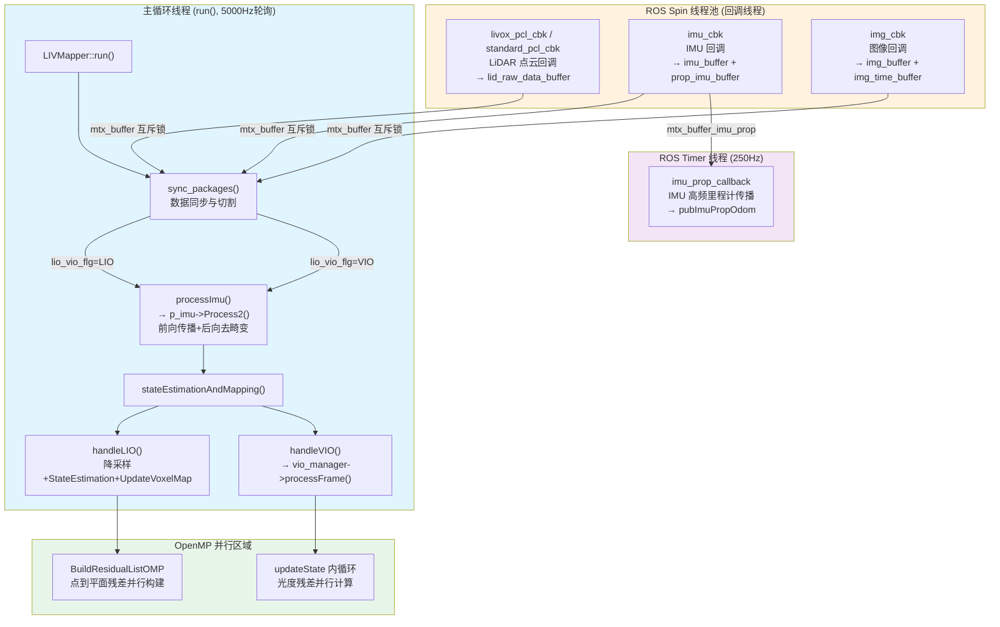
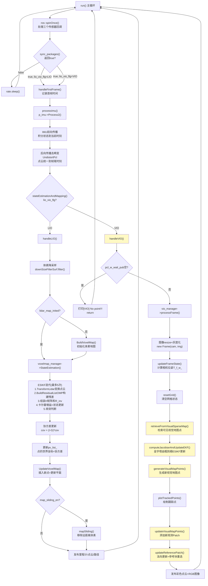
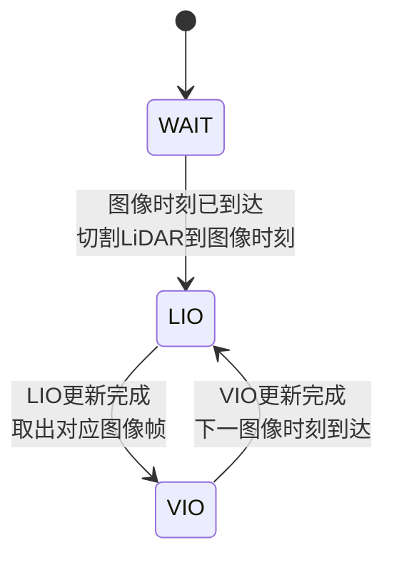
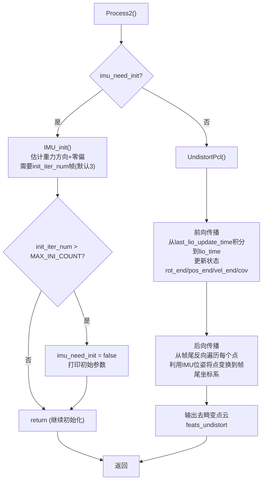
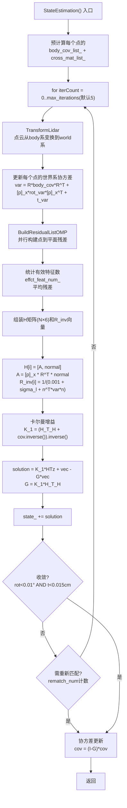
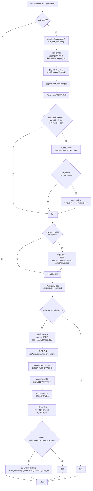

# FAST-LIVO2 源代码级深度解析：执行流程、线程调用与影像处理细节

> **仓库**：https://github.com/hku-mars/FAST-LIVO2
> **分析版本**：main 分支（2024-08）
> **总代码量**：6129 行（src/*.cpp）+ 头文件

---

## 一、代码仓库结构与文件行数

### 1.1 源文件统计

| 文件 | 行数 | 核心职责 |
|------|------|---------|
| `src/main.cpp` | 11 | ROS 节点入口，实例化 LIVMapper 并调用 run() |
| `src/frame.cpp` | 65 | 帧数据结构，图像金字塔创建 |
| `src/visual_point.cpp` | 126 | 视觉地图点管理（增删查、参考块选择） |
| `src/IMU_Processing.cpp` | 587 | IMU 初始化、前向传播、后向传播去畸变 |
| `src/voxel_map.cpp` | 970 | 体素地图管理、LiDAR 点到平面残差、ESIKF LiDAR 更新 |
| `src/preprocess.cpp` | 1125 | LiDAR 点云预处理（多型号适配、时间戳计算、滤波） |
| `src/LIVMapper.cpp` | 1370 | 系统总调度：回调、同步、主循环、LIO/VIO 分发、发布 |
| `src/vio.cpp` | **1875** | **视觉处理核心**：稀疏直接法、仿射变换、光度误差、ESIKF Visual 更新 |

### 1.2 头文件结构

| 文件 | 核心类/结构 |
|------|------------|
| `include/LIVMapper.h` | `LIVMapper` 系统总指挥类 |
| `include/vio.h` | `VIOManager` 视觉管理器、`SubSparseMap`、`Warp`、`VOXEL_POINTS` |
| `include/visual_point.h` | `VisualPoint` 视觉地图点（3D位置+法向+观测Patch列表） |
| `include/feature.h` | `Feature` 图像Patch特征（像素坐标+单位向量+Patch数据+位姿+逆曝光时间） |
| `include/frame.h` | `Frame` 帧（图像+位姿+相机模型） |
| `include/voxel_map.h` | `VoxelMapManager`、`VoxelOctoTree`、`VoxelPlane`、`PointToPlane` |
| `include/IMU_Processing.h` | `ImuProcess`、`StatesGroup`（20维状态）、`LidarMeasureGroup` |
| `include/preprocess.h` | `Preprocess` 点云预处理 |
| `include/common_lib.h` | 通用类型定义（V3D/M3D/SE3、宏定义） |
| `include/utils/so3_math.h` | 李代数运算（Exp/Log/反对称矩阵） |

---

## 二、线程调用图

FAST-LIVO2 采用 **ROS 单节点多回调 + 主循环轮询** 架构，共涉及以下线程：



### 2.1 线程间同步机制

| 同步原语 | 保护资源 | 使用位置 |
|---------|---------|---------|
| `mtx_buffer` | `lid_raw_data_buffer`、`imu_buffer`、`img_buffer` | 三个回调写入 + sync_packages 读取 |
| `mtx_buffer_imu_prop` | `prop_imu_buffer`、`newest_imu`、`new_imu` | imu_cbk 写入 + imu_prop_callback 读取 |
| `sig_buffer` | 条件变量，通知主循环有新数据 | 回调中 `notify_all()` |
| OpenMP `#pragma omp parallel for` | 残差构建并行 | BuildResidualListOMP、updateState |

### 2.2 各线程频率

| 线程 | 频率 | 说明 |
|------|------|------|
| LiDAR 回调 | 10 Hz (Livox) / 可变 | 每帧点云 |
| IMU 回调 | 200 Hz | 角速度+加速度 |
| 图像回调 | 10-50 Hz | 取决于相机 |
| 主循环 run() | 5000 Hz 轮询 | `ros::Rate rate(5000)`，无数据时 sleep |
| IMU 传播定时器 | 250 Hz | `ros::Duration(0.004)`，仅 `imu_prop_enable=true` 时有效 |

---

## 三、主循环代码级执行流程

### 3.1 入口：main.cpp (L1-11)

```cpp
int main(int argc, char **argv) {
    ros::init(argc, argv, "fast_livo2");
    ros::NodeHandle nh;
    image_transport::ImageTransport it(nh);
    LIVMapper liv_mapper(nh);
    liv_mapper.initializeSubscribersAndPublishers(nh, it);
    liv_mapper.run();  // 阻塞主循环
    return 0;
}
```

### 3.2 主循环：LIVMapper::run() (LIVMapper.cpp 约 L540-555)

```cpp
void LIVMapper::run() {
  ros::Rate rate(5000);
  while (ros::ok()) {
    ros::spinOnce();                    // 处理回调
    if (!sync_packages(LidarMeasures)) { // 数据同步
      rate.sleep();
      continue;
    }
    handleFirstFrame();                 // 首帧时间记录
    processImu();                       // IMU传播+去畸变
    stateEstimationAndMapping();        // LIO或VIO更新
  }
  savePCD();                            // 退出时保存地图
}
```

### 3.3 完整单帧执行流程图（代码级）



---

## 四、数据同步：sync_packages() 代码级详解

### 4.1 函数签名与位置

- **文件**：`src/LIVMapper.cpp`
- **行号**：约 L950-1170
- **签名**：`bool sync_packages(LidarMeasureGroup &meas)`
- **输入**：`LidarMeasureGroup &meas`（包含缓冲的点云、IMU、图像及状态标志）
- **输出**：`bool`（true=同步成功可处理，false=数据不足继续等待）
- **修改**：`meas.lio_vio_flg`（LIO/VIO状态切换）、`meas.pcl_proc_cur/next`（切割后的点云）、`meas.measures`（IMU数据组）

### 4.2 LIVO 模式下的状态机



### 4.3 WAIT/VIO → LIO 分支（点云切割核心代码）

```cpp
case WAIT:
case VIO: {
    // 1. 计算图像拍摄时刻（加上曝光时间初始值）
    double img_capture_time = img_time_buffer.front() + exposure_time_init;

    // 2. 异常检查：图像时间早于上次更新时间 → 丢弃该帧
    if (img_capture_time < meas.last_lio_update_time + 0.00001) {
        img_buffer.pop_front();
        img_time_buffer.pop_front();
        ROS_ERROR("[ Data Cut ] Throw one image frame!");
        return false;
    }

    // 3. 等待检查：图像时刻超过最新LiDAR/IMU时间 → 数据未到齐
    double lid_newest_time = lid_header_time_buffer.back() +
        lid_raw_data_buffer.back()->points.back().curvature / 1000.0;
    double imu_newest_time = imu_buffer.back()->header.stamp.toSec();
    if (img_capture_time > lid_newest_time || img_capture_time > imu_newest_time)
        return false;

    // 4. 提取该时段的IMU数据
    m.lio_time = img_capture_time;
    while (!imu_buffer.empty()) {
        if (imu_buffer.front()->header.stamp.toSec() > m.lio_time) break;
        if (imu_buffer.front()->header.stamp.toSec() > meas.last_lio_update_time)
            m.imu.push_back(imu_buffer.front());
        imu_buffer.pop_front();
    }

    // 5. 点云切割：将上一帧剩余的pcl_proc_next作为当前帧起点
    *(meas.pcl_proc_cur) = *(meas.pcl_proc_next);
    PointCloudXYZI().swap(*meas.pcl_proc_next);

    // 6. 遍历LiDAR缓冲区，按时间戳切割
    while (!lid_raw_data_buffer.empty()) {
        if (lid_header_time_buffer.front() > img_capture_time) break;
        auto pcl(lid_raw_data_buffer.front()->points);
        double frame_header_time(lid_header_time_buffer.front());
        float max_offs_time_ms = (m.lio_time - frame_header_time) * 1000.0f;
        for (int i = 0; i < pcl.size(); i++) {
            auto pt = pcl[i];
            if (pcl[i].curvature < max_offs_time_ms) {
                // 时间戳 < 图像时刻 → 当前帧
                pt.curvature += (frame_header_time - meas.last_lio_update_time) * 1000.0f;
                meas.pcl_proc_cur->points.push_back(pt);
            } else {
                // 时间戳 > 图像时刻 → 留给下一帧
                pt.curvature += (frame_header_time - m.lio_time) * 1000.0f;
                meas.pcl_proc_next->points.push_back(pt);
            }
        }
        lid_raw_data_buffer.pop_front();
        lid_header_time_buffer.pop_front();
    }
    meas.measures.push_back(m);
    meas.lio_vio_flg = LIO;  // 切换状态
    return true;
}
```

**关键细节**：
- `curvature` 字段被复用为**点相对帧头的时间偏移（ms）**；
- 切割后 `pcl_proc_cur` 中所有点的 `curvature` 被重新基准化为相对 `last_lio_update_time` 的偏移；
- 跨越图像时刻的 LiDAR 帧被**一分为二**，确保 LIO 更新精确对齐到图像曝光中心时刻。

### 4.4 LIO → VIO 分支

```cpp
case LIO: {
    double img_capture_time = img_time_buffer.front() + exposure_time_init;
    meas.lio_vio_flg = VIO;
    meas.measures.clear();
    struct MeasureGroup m;
    m.vio_time = img_capture_time;
    m.lio_time = meas.last_lio_update_time;
    m.img = img_buffer.front();  // 取出对应图像
    img_buffer.pop_front();
    img_time_buffer.pop_front();
    meas.measures.push_back(m);
    lidar_pushed = false;
    return true;
}
```

### 4.5 异常情况处理汇总

| 异常情况 | 代码位置 | 处理方式 |
|---------|---------|---------|
| LiDAR 缓冲区为空 | 函数开头 | `return false` |
| 图像缓冲区为空 | 函数开头 | `return false` |
| IMU 缓冲区为空 | 函数开头 | `return false` |
| 图像时间早于上次更新 | WAIT分支 | 丢弃该帧图像，`return false` |
| 图像时间超过最新LiDAR/IMU | WAIT分支 | `return false`（等待数据） |
| LiDAR时间戳回环 | `livox_pcl_cbk` | 清空 `lid_raw_data_buffer` |
| IMU时间戳回环 | `imu_cbk` | 解锁并 `return`（不插入） |
| 图像时间戳回环 | `img_cbk` | `return`（不插入） |
| 空点云 | `livox_pcl_cbk` | `ROS_ERROR` 后 `return` |
| 图像间隔过短(<20ms) | `img_cbk` | 警告后 `return` |

---

## 五、IMU 处理：Process2() 代码级详解

### 5.1 函数信息

- **文件**：`src/IMU_Processing.cpp`
- **行号**：L543-587（Process2）+ L237-541（UndistortPcl）
- **调用链**：`LIVMapper::processImu()` → `p_imu->Process2(LidarMeasures, _state, feats_undistort)`

### 5.2 执行流程



### 5.3 前向传播核心（积分公式）

```cpp
// 中值积分：对相邻两帧IMU取平均
V3D angvel_avr = 0.5 * (imu_1.angular_velocity + imu_2.angular_velocity) - state.bias_g;
V3D acc_avr = 0.5 * (imu_1.linear_acceleration + imu_2.linear_acceleration) - state.bias_a;

// 姿态更新（罗德里格斯公式）
M3D Exp_f = Exp(angvel_avr, dt);
state.rot_end = state.rot_end * Exp_f;

// 速度更新
V3D acc_imu = state.rot_end * acc_avr + state.gravity;
state.vel_end = state.vel_end + acc_imu * dt;

// 位置更新
state.pos_end = state.pos_end + state.vel_end * dt + 0.5 * acc_imu * dt * dt;

// 协方差传播（状态转移矩阵F + 噪声雅可比W）
state.cov = F * state.cov * F.transpose() + W * Q * W.transpose();
```

### 5.4 后向传播去畸变核心（UndistortPcl）

```cpp
// 从帧尾反向遍历IMU位姿，构建IMUpose列表
// 每个IMUpose包含: offset_time, rot, pos, vel, acc, gyr
for (auto it_kp = IMUpose.end() - 1; it_kp != IMUpose.begin(); it_kp--) {
    auto head = it_kp - 1;
    R_imu << MAT_FROM_ARRAY(head->rot);
    acc_imu << VEC_FROM_ARRAY(head->acc);
    vel_imu << VEC_FROM_ARRAY(head->vel);
    pos_imu << VEC_FROM_ARRAY(head->pos);
    angvel_avr << VEC_FROM_ARRAY(head->gyr);

    // 对点云中时间戳在该IMU区间内的点进行变换
    for (; it_pcl->curvature / 1000.0 > head->offset_time; it_pcl--) {
        dt = it_pcl->curvature / 1000.0 - head->offset_time;
        // 该点采集时刻的IMU旋转
        M3D R_i(R_imu * Exp(angvel_avr, dt));
        // 该点采集时刻相对帧尾的平移
        V3D T_ei(pos_imu + vel_imu * dt + 0.5 * acc_imu * dt * dt - state_inout.pos_end);
        V3D P_i(it_pcl->x, it_pcl->y, it_pcl->z);
        // 补偿运动畸变：点从采集时刻变换到帧尾时刻
        V3D P_compensate = extR_Ri * (R_i * (Lid_rot_to_IMU * P_i + Lid_offset_to_IMU) + T_ei) - exrR_extT;
        it_pcl->x = P_compensate(0);
        it_pcl->y = P_compensate(1);
        it_pcl->z = P_compensate(2);
    }
}
```

---

## 六、LiDAR 更新：StateEstimation() 代码级详解

### 6.1 函数信息

- **文件**：`src/voxel_map.cpp`
- **行号**：L338-530
- **签名**：`void VoxelMapManager::StateEstimation(StatesGroup &state_propagat)`
- **输入**：`state_propagat`（IMU传播的先验状态，用于计算先验-状态差 vec）
- **输入（成员变量）**：`feats_down_body_`（降采样点云）、`state_`（当前状态估计）、`voxel_map_`（体素地图）
- **输出（成员变量）**：`state_`（更新后状态）、`ptpl_list_`（有效匹配列表）、`pv_list_`（点+协方差列表）

### 6.2 迭代更新流程



### 6.3 BuildResidualListOMP 核心（L643-923）

```cpp
void VoxelMapManager::BuildResidualListOMP(
    std::vector<pointWithVar> &pv_list,
    std::vector<PointToPlane> &ptpl_list)
{
    std::mutex mylock;
    std::vector<PointToPlane> all_ptpl_list(pv_list.size());
    std::vector<bool> useful_ptpl(pv_list.size(), false);

    #pragma omp parallel for
    for (size_t i = 0; i < pv_list.size(); ++i) {
        // 1. 计算点所在体素坐标
        V3D point_w = pv_list[i].point_w;
        int loc_xyz[3];
        for (int j = 0; j < 3; j++) {
            loc_xyz[j] = floor(point_w[j] / voxel_size);
            if (loc_xyz[j] < 0) loc_xyz[j] -= 1;
        }
        VOXEL_LOCATION position(loc_xyz[0], loc_xyz[1], loc_xyz[2]);

        // 2. 在哈希表中查找体素
        auto iter = voxel_map_.find(position);
        if (iter == voxel_map_.end()) continue;

        // 3. 在八叉树中查找最近的叶节点平面
        VoxelOctoTree *octo_tree = iter->second;
        VoxelOctoTree *nearest_node = octo_tree->find_correspond(point_w);
        if (!nearest_node || !nearest_node->plane_ptr_->is_plane_) continue;

        // 4. 计算点到平面的有符号距离
        VoxelPlane &plane = *nearest_node->plane_ptr_;
        double dis_to_plane = plane.normal_.dot(point_w - plane.center_);

        // 5. 距离阈值判断（考虑平面不确定性）
        double sigma = sqrt(plane.normal_.transpose() * pv_list[i].var * plane.normal_ + ...);
        if (fabs(dis_to_plane) > sigma_num * sigma) continue;

        // 6. 存入匹配列表
        all_ptpl_list[i].point_w_ = point_w;
        all_ptpl_list[i].point_b_ = pv_list[i].point_b;
        all_ptpl_list[i].normal_ = plane.normal_;
        all_ptpl_list[i].center_ = plane.center_;
        all_ptpl_list[i].dis_to_plane_ = dis_to_plane;
        all_ptpl_list[i].plane_var_ = plane.plane_var_;
        all_ptpl_list[i].body_cov_ = pv_list[i].body_var;
        useful_ptpl[i] = true;
    }
    // 7. 收集有效匹配
    for (size_t i = 0; i < pv_list.size(); ++i)
        if (useful_ptpl[i]) ptpl_list.push_back(all_ptpl_list[i]);
}
```

### 6.4 ESIKF 更新数学核心

```cpp
// 信息矩阵形式的卡尔曼增益（避免大矩阵求逆）
H_T_H.block<6,6>(0,0) = Hsub_T_R_inv * Hsub;  // H^T * R^-1 * H
K_1 = (H_T_H + state_.cov.inverse()).inverse(); // (H^T R^-1 H + P^-1)^-1
G = K_1 * H_T_H;                                // 卡尔曼增益 * H^T R^-1 H

// 状态更新（迭代EKF形式，包含先验拉回项）
vec = state_propagat - state_;                  // 先验-当前状态差
solution = K_1 * HTz + vec - G * vec;           // 完整更新量
state_ += solution;                             // 名义状态更新

// 收敛判断
if (rot_add.norm() * 57.3 < 0.01 && t_add.norm() * 100 < 0.015)
    flg_EKF_converged = true;
```

---

## 七、影像处理核心：VIOManager 代码级详解（重点）

### 7.1 视觉处理主入口：processFrame()

- **文件**：`src/vio.cpp`
- **行号**：约 L1770-1875
- **签名**：
  ```cpp
  void VIOManager::processFrame(
      cv::Mat &img,                              // 输入图像(BGR)
      vector<pointWithVar> &pg,                  // LiDAR点列表(含位置+法向+协方差)
      const unordered_map<VOXEL_LOCATION, VoxelOctoTree*> &feat_map, // 体素地图
      double img_time)                           // 图像时间戳
  ```

#### 7.1.1 执行步骤与耗时统计


代码中的耗时统计：
```cpp
double t1 = omp_get_wtime();
retrieveFromVisualSparseMap(img, pg, feat_map);     // t2-t1
double t2 = omp_get_wtime();
computeJacobianAndUpdateEKF(img);                    // t3-t2 (含compute_jacobian_time, update_ekf_time)
double t3 = omp_get_wtime();
generateVisualMapPoints(img, pg);                    // t4-t3
double t4 = omp_get_wtime();
plotTrackedPoints();
if (plot_flag) projectPatchFromRefToCur(feat_map);  // 调试用
double t5 = omp_get_wtime();
updateVisualMapPoints(img);                          // t6-t5
double t6 = omp_get_wtime();
updateReferencePatch(feat_map);                      // t7-t6
double t7 = omp_get_wtime();
// 平均耗时(排除plot时间): ave_total = ... + (t7-t1-(t5-t4))/frame_count
```

---

### 7.2 视觉地图点检索：retrieveFromVisualSparseMap()

- **文件**：`src/vio.cpp`
- **行号**：约 L430-760
- **输入**：`img`（灰度图）、`pg`（当前帧LiDAR点列表）、`plane_map`（体素地图）
- **输出（成员变量）**：`visual_submap`（检索到的视觉子地图，含点、warp_patch、误差、搜索层级等）

#### 7.2.1 执行流程



#### 7.2.2 深度图构建代码

```cpp
cv::Mat depth_img = cv::Mat::zeros(height, width, CV_32FC1);
float *it = (float *)depth_img.data;

for (int i = 0; i < pg.size(); i++) {
    V3D pt_w = pg[i].point_w;
    V3D pt_c = new_frame_->w2f(pt_w);  // 世界系→相机系
    if (pt_c[2] > 0) {
        V2D px = new_frame_->cam_->world2cam(pt_c);  // 相机系→像素
        if (new_frame_->cam_->isInFrame(px.cast<int>(), border)) {
            float depth = pt_c[2];
            int col = int(px[0]);
            int row = int(px[1]);
            it[width * row + col] = depth;  // 写入深度图
        }
    }
}
```

#### 7.2.3 深度连续性外点剔除代码

```cpp
V3D pt_cam = new_frame_->w2f(pt->pos_);
bool depth_continous = false;
// 检查Patch邻域内的深度一致性
for (int u = -patch_size_half; u <= patch_size_half; u++) {
    for (int v = -patch_size_half; v <= patch_size_half; v++) {
        if (u == 0 && v == 0) continue;
        float depth = it[width * (v + int(pc[1])) + u + int(pc[0])];
        if (depth == 0.) continue;
        double delta_dist = abs(pt_cam[2] - depth);
        if (delta_dist > 0.5) {  // 深度差超过0.5m判定为不连续
            depth_continous = true;
            break;
        }
    }
    if (depth_continous) break;
}
if (depth_continous) continue;  // 剔除该点
```

#### 7.2.4 参考Patch选择代码（normal_en=true模式）

```cpp
if (pt->obs_.size() == 1) {
    ref_ftr = *pt->obs_.begin();
    pt->ref_patch = ref_ftr;
    pt->has_ref_patch_ = true;
} else if (!pt->has_ref_patch_) {
    // 多个观测时，选与其他观测光度误差最小的作为参考
    float phtometric_errors_min = std::numeric_limits<float>::max();
    for (auto it = pt->obs_.begin(); it != pt->obs_.end(); ++it) {
        Feature *ref_patch_temp = *it;
        float *patch_temp = ref_patch_temp->patch_;
        float phtometric_errors = 0.0;
        int count = 0;
        for (auto itm = pt->obs_.begin(); itm != pt->obs_.end(); ++itm) {
            if ((*itm)->id_ == ref_patch_temp->id_) continue;
            float *patch_cache = (*itm)->patch_;
            for (int ind = 0; ind < patch_size_total; ind++)
                phtometric_errors += (patch_temp[ind] - patch_cache[ind]) *
                                     (patch_temp[ind] - patch_cache[ind]);
            count++;
        }
        phtometric_errors /= count;
        if (phtometric_errors < phtometric_errors_min) {
            phtometric_errors_min = phtometric_errors;
            ref_ftr = ref_patch_temp;
        }
    }
    pt->ref_patch = ref_ftr;
    pt->has_ref_patch_ = true;
} else {
    ref_ftr = pt->ref_patch;  // 已有参考块，直接使用
}
```

#### 7.2.5 按需射线投射代码（raycast_en=true）

```cpp
// 初始化时预计算每个网格中心的射线采样点
// rays_with_sample_points[i] 存储第i个网格中心射线在[d_min, d_max]上的采样3D点
for (int grid_row = 1; grid_row <= grid_n_height; grid_row++) {
    for (int grid_col = 1; grid_col <= grid_n_width; grid_col++) {
        int u = grid_size / 2 + (grid_col - 1) * grid_size;
        int v = grid_size / 2 + (grid_row - 1) * grid_size;
        for (float d_temp = 0.1; d_temp <= 3.0; d_temp += 0.2) {
            V3D xyz = cam->cam2world(u, v);  // 像素→单位向量
            xyz *= d_temp / xyz[2];           // 缩放到指定深度
            SamplePointsEachGrid.push_back(xyz);
        }
        rays_with_sample_points.push_back(SamplePointsEachGrid);
    }
}

// 运行时：对无覆盖的网格执行射线投射
for (int i = 0; i < length; i++) {
    if (grid_num[i] == TYPE_MAP || border_flag[i] == 1) continue;
    for (const auto &it : rays_with_sample_points[i]) {
        V3D sample_point_w = new_frame_->f2w(it);  // 相机系→世界系
        // 查找该采样点所在体素
        VOXEL_LOCATION sample_pos(...);
        auto corre_feat_map = feat_map.find(sample_pos);
        if (corre_feat_map != feat_map.end()) {
            // 找到视觉点，加入检索结果
            ...
            break;
        } else {
            // 查找LiDAR平面，加入add_from_voxel_map（用于生成新视觉点）
            auto iter = plane_map.find(sample_pos);
            if (iter != plane_map.end()) {
                VoxelOctoTree *current_octo = iter->second->find_correspond(sample_point_w);
                if (current_octo->plane_ptr_->is_plane_) {
                    visual_submap->add_from_voxel_map.push_back(plane_center);
                    break;
                }
            }
        }
    }
}
```

---

### 7.3 仿射变换计算：getWarpMatrixAffineHomography()

- **文件**：`src/vio.cpp`
- **行号**：约 L290-320
- **基于平面先验的单应矩阵仿射变换**

```cpp
void VIOManager::getWarpMatrixAffineHomography(
    const vk::AbstractCamera &cam,
    const V2D &px_ref,       // 参考帧像素坐标
    const V3D &xyz_ref,      // 参考帧相机系下3D点
    const V3D &normal_ref,   // 参考帧相机系下平面法向
    const SE3 &T_cur_ref,    // 参考帧→当前帧变换
    const int level_ref,
    Matrix2d &A_cur_ref)     // 输出：2×2仿射矩阵
{
    // 1. 构建单应矩阵 H = R + t * n^T / (n^T * p)
    const V3D t = T_cur_ref.inverse().translation();
    const Eigen::Matrix3d H_cur_ref =
        T_cur_ref.rotation_matrix() *
        (normal_ref.dot(xyz_ref) * Eigen::Matrix3d::Identity() - t * normal_ref.transpose());

    // 2. 取参考Patch中心及其u/v方向偏移点，通过H变换到当前帧
    const int kHalfPatchSize = 4;
    V3D f_du_ref = cam.cam2world(px_ref + V2D(kHalfPatchSize, 0) * (1 << level_ref));
    V3D f_dv_ref = cam.cam2world(px_ref + V2D(0, kHalfPatchSize) * (1 << level_ref));

    const V3D f_cur = H_cur_ref * xyz_ref;
    const V3D f_du_cur = H_cur_ref * f_du_ref;
    const V3D f_dv_cur = H_cur_ref * f_dv_ref;

    // 3. 投影到像素，计算仿射矩阵的两列
    V2D px_cur = cam.world2cam(f_cur);
    V2D px_du_cur = cam.world2cam(f_du_cur);
    V2D px_dv_cur = cam.world2cam(f_dv_cur);
    A_cur_ref.col(0) = (px_du_cur - px_cur) / kHalfPatchSize;
    A_cur_ref.col(1) = (px_dv_cur - px_cur) / kHalfPatchSize;
}
```

**输入输出参数表**：

| 参数 | 类型 | 方向 | 说明 |
|------|------|------|------|
| `cam` | `vk::AbstractCamera&` | 输入 | 相机模型（针孔/鱼眼） |
| `px_ref` | `V2D` | 输入 | 参考帧Patch中心像素坐标 |
| `xyz_ref` | `V3D` | 输入 | 参考帧相机系下3D点坐标 |
| `normal_ref` | `V3D` | 输入 | 参考帧相机系下平面法向量（来自LiDAR平面先验） |
| `T_cur_ref` | `SE3` | 输入 | 参考帧到当前帧的位姿变换 |
| `level_ref` | `int` | 输入 | 参考Patch所在金字塔层级 |
| `A_cur_ref` | `Matrix2d&` | 输出 | 2×2仿射变换矩阵 |

**异常处理**：无显式异常，但如果 `H_cur_ref` 退化（相机纯旋转无平移），后续 `warpAffine` 中会检测 `A_ref_cur` 是否为 NaN。

---

### 7.4 Patch 扭曲：warpAffine()

- **文件**：`src/vio.cpp`
- **行号**：约 L355-390
- **将参考Patch通过仿射矩阵扭曲到当前帧坐标系**

```cpp
void VIOManager::warpAffine(
    const Matrix2d &A_cur_ref,     // 仿射矩阵
    const cv::Mat &img_ref,        // 参考帧图像
    const Vector2d &px_ref,        // 参考帧Patch中心
    const int level_ref,
    const int search_level,        // 搜索金字塔层级
    const int pyramid_level,       // 当前金字塔层级
    const int halfpatch_size,
    float *patch)                  // 输出：扭曲后的Patch数据
{
    const Matrix2f A_ref_cur = A_cur_ref.inverse().cast<float>();
    if (isnan(A_ref_cur(0, 0))) {
        printf("Affine warp is NaN, probably camera has no translation\n");
        return;  // 异常：仿射矩阵不可逆
    }

    for (int y = 0; y < patch_size; ++y) {
        for (int x = 0; x < patch_size; ++x) {
            // 当前帧Patch内相对中心的坐标
            Vector2f px_patch(x - halfpatch_size, y - halfpatch_size);
            px_patch *= (1 << search_level);
            px_patch *= (1 << pyramid_level);
            // 逆仿射变换到参考帧坐标
            const Vector2f px(A_ref_cur * px_patch + px_ref.cast<float>());
            // 边界检查
            if (px[0] < 0 || px[1] < 0 || px[0] >= img_ref.cols - 1 || px[1] >= img_ref.rows - 1)
                patch[patch_size_total * pyramid_level + y * patch_size + x] = 0;
            else
                // 双线性插值采样
                patch[patch_size_total * pyramid_level + y * patch_size + x] =
                    (float)vk::interpolateMat_8u(img_ref, px[0], px[1]);
        }
    }
}
```

**异常处理**：
- 仿射矩阵含 NaN → 打印警告并 return（Patch保持全零）；
- 采样坐标越界 → 该像素置 0。

---

### 7.5 图像Patch提取：getImagePatch()

- **文件**：`src/vio.cpp`
- **行号**：约 L235-265
- **带亚像素精度的双线性插值Patch提取**

```cpp
void VIOManager::getImagePatch(cv::Mat img, V2D pc, float *patch_tmp, int level)
{
    const float u_ref = pc[0], v_ref = pc[1];
    const int scale = (1 << level);
    // 计算整数坐标和亚像素偏移
    const int u_ref_i = floorf(pc[0] / scale) * scale;
    const int v_ref_i = floorf(pc[1] / scale) * scale;
    const float subpix_u_ref = (u_ref - u_ref_i) / scale;
    const float subpix_v_ref = (v_ref - v_ref_i) / scale;
    // 双线性插值四个权重
    const float w_tl = (1 - subpix_u_ref) * (1 - subpix_v_ref);
    const float w_tr = subpix_u_ref * (1 - subpix_v_ref);
    const float w_bl = (1 - subpix_u_ref) * subpix_v_ref;
    const float w_br = subpix_u_ref * subpix_v_ref;

    for (int x = 0; x < patch_size; x++) {
        uint8_t *img_ptr = (uint8_t *)img.data +
            (v_ref_i - patch_size_half * scale + x * scale) * width +
            (u_ref_i - patch_size_half * scale);
        for (int y = 0; y < patch_size; y++, img_ptr += scale) {
            patch_tmp[patch_size_total * level + x * patch_size + y] =
                w_tl * img_ptr[0] + w_tr * img_ptr[scale] +
                w_bl * img_ptr[scale * width] + w_br * img_ptr[scale * width + scale];
        }
    }
}
```

---

### 7.6 ESIKF 视觉更新：computeJacobianAndUpdateEKF() + updateState()

#### 7.6.1 顶层调度

- **文件**：`src/vio.cpp`
- **行号**：约 L765-780

```cpp
void VIOManager::computeJacobianAndUpdateEKF(cv::Mat img) {
    if (total_points == 0) return;
    // 金字塔由粗到细：从最高层(最粗)到第0层(原图)
    for (int level = patch_pyrimid_level - 1; level >= 0; level--) {
        if (inverse_composition_en)
            updateStateInverse(img, level);  // 逆组合公式
        else
            updateState(img, level);         // 正向公式（默认）
    }
    state->cov -= G * state->cov;  // 最终协方差更新
    updateFrameState(*state);       // 更新帧位姿
}
```

#### 7.6.2 updateState() 正向公式（默认，约 L1430-1580）

```cpp
void VIOManager::updateState(cv::Mat img, int level) {
    StatesGroup old_state = (*state);
    const int H_DIM = total_points * patch_size_total;  // 残差维度
    z.resize(H_DIM); z.setZero();
    H_sub.resize(H_DIM, 7); H_sub.setZero();  // 7列: 旋转3+平移3+曝光1

    for (int iteration = 0; iteration < max_iterations; iteration++) {
        // 1. 计算当前相机位姿
        M3D Rwi(state->rot_end);
        V3D Pwi(state->pos_end);
        Rcw = Rci * Rwi.transpose();      // 世界→相机旋转
        Pcw = -Rci * Rwi.transpose() * Pwi + Pci;  // 世界→相机平移

        float error = 0.0;
        int n_meas = 0;

        #pragma omp parallel for reduction(+:error, n_meas)
        for (int i = 0; i < total_points; i++) {
            VisualPoint *pt = visual_submap->voxel_points[i];
            // 2. 3D点投影到当前帧
            V3D pf = Rcw * pt->pos_ + Pcw;
            V2D pc = cam->world2cam(pf);
            computeProjectionJacobian(pf, Jdpi);  // 投影雅可比(2×3)

            int scale = (1 << (level + search_level));
            // 3. 亚像素插值权重
            float subpix_u = ..., subpix_v = ...;
            float w_tl = ..., w_tr = ..., w_bl = ..., w_br = ...;

            vector<float> P = visual_submap->warp_patch[i];
            double inv_ref_expo = visual_submap->inv_expo_list[i];

            for (int x = 0; x < patch_size; x++) {
                uint8_t *img_ptr = ...;
                for (int y = 0; y < patch_size; y++, img_ptr += scale) {
                    // 4. 计算图像梯度(中心差分)
                    float du = 0.5 * ((w_tl*img_ptr[scale] + ...) - (w_tl*img_ptr[-scale] + ...));
                    float dv = 0.5 * ((w_tl*img_ptr[width*scale] + ...) - (w_tl*img_ptr[-width*scale] + ...));
                    Jimg << du, dv;
                    Jimg = Jimg * state->inv_expo_time / scale;

                    // 5. 链式法则计算雅可比
                    // Jdphi = Jimg * Jdpi * [pf]_x  (对位姿旋转的雅可比)
                    // Jdp = -Jimg * Jdpi           (对位姿平移的雅可比)
                    // JdR = Jdphi * Jdphi_dR + Jdp * Jdp_dR  (转换到IMU系)
                    // Jdt = Jdp * Jdp_dt
                    Jdphi = Jimg * Jdpi * p_hat;
                    Jdp = -Jimg * Jdpi;
                    JdR = Jdphi * Jdphi_dR + Jdp * Jdp_dR;
                    Jdt = Jdp * Jdp_dt;

                    // 6. 当前像素值(双线性插值)
                    double cur_value = w_tl*img_ptr[0] + w_tr*img_ptr[scale] +
                                       w_bl*img_ptr[width*scale] + w_br*img_ptr[width*scale+scale];

                    // 7. 光度残差: τ_cur * I_cur(u) - τ_ref * I_ref(warp(u))
                    double res = state->inv_expo_time * cur_value -
                                 inv_ref_expo * P[patch_size_total * level + x*patch_size + y];
                    z(idx) = res;
                    patch_error += res * res;
                    n_meas++;

                    // 8. 填充H矩阵: 前6列位姿, 第7列曝光时间(导数=cur_value)
                    if (exposure_estimate_en)
                        H_sub.block<1,7>(idx,0) << JdR, Jdt, cur_value;
                    else
                        H_sub.block<1,6>(idx,0) << JdR, Jdt;
                }
            }
            error += patch_error;
        }
        error /= n_meas;

        // 9. ESIKF更新
        if (error <= last_error) {
            old_state = (*state);
            last_error = error;
            H_T_H.block<7,7>(0,0) = H_sub.transpose() * H_sub;
            K_1 = (H_T_H + (state->cov / img_point_cov).inverse()).inverse();
            vec = (*state_propagat) - (*state);
            G = K_1 * H_T_H;
            solution = -K_1 * H_sub.transpose() * z + vec - G * vec;
            (*state) += solution;
            // 收敛判断
            if (rot_add.norm()*57.3 < 0.001 && t_add.norm()*100 < 0.001)
                EKF_end = true;
        } else {
            (*state) = old_state;  // 误差上升，回退
            EKF_end = true;
        }
        if (EKF_end) break;
    }
}
```

#### 7.6.3 投影雅可比 computeProjectionJacobian()

```cpp
void VIOManager::computeProjectionJacobian(V3D p, MD(2,3) &J) {
    const double x = p[0], y = p[1], z_inv = 1.0 / p[2], z_inv_2 = z_inv * z_inv;
    J(0,0) = fx * z_inv;    J(0,1) = 0;           J(0,2) = -fx * x * z_inv_2;
    J(1,0) = 0;             J(1,1) = fy * z_inv;  J(1,2) = -fy * y * z_inv_2;
}
```

#### 7.6.4 逆组合公式 updateStateInverse()（约 L1310-1425）

与正向公式的核心区别：
- 雅可比在**参考帧**上预计算（`precomputeReferencePatches()`），迭代时只需更新残差；
- `H_sub_inv` 矩阵在首次迭代时计算并缓存（`has_ref_patch_cache` 标志）；
- 迭代时通过坐标变换将参考帧雅可比转换到当前帧：
  ```cpp
  JdR = J_dR * Rwi + J_dt * P_wi_hat * Rwi;  // 旋转雅可比变换
  Jdt = J_dt * Rwi;                           // 平移雅可比变换
  ```
- 残差计算方式相同：当前帧插值 - 参考warp_patch。

#### 7.6.5 视觉更新异常处理

| 异常情况 | 处理方式 |
|---------|---------|
| `total_points == 0` | 直接 return，不执行更新 |
| 迭代中误差上升 `error > last_error` | 回退到 `old_state`，终止迭代 |
| 点投影到相机后方 `pf[2] <= 0` | 该点不参与残差计算（隐式跳过） |
| 仿射矩阵 NaN | `warpAffine` 中检测，Patch置零 |
| 曝光时间估计为负 | 代码中有注释掉的重置逻辑（默认不处理） |
| 金字塔某层无有效测量 | `n_meas=0` 时 `error/0` 风险（实际由total_points>0保证） |

---

### 7.7 新视觉地图点生成：generateVisualMapPoints()

- **文件**：`src/vio.cpp`
- **行号**：约 L790-890
- **输入**：`img`（灰度图）、`pg`（LiDAR点列表）
- **输出**：新的 `VisualPoint` 插入 `feat_map`

```cpp
void VIOManager::generateVisualMapPoints(cv::Mat img, vector<pointWithVar> &pg) {
    if (pg.size() <= 10) return;

    // 1. 遍历LiDAR点，在无视觉点的网格中选Shi-Tomasi分数最高的点
    for (int i = 0; i < pg.size(); i++) {
        if (pg[i].normal == V3D(0,0,0)) continue;
        V2D pc = new_frame_->w2c(pg[i].point_w);
        if (new_frame_->cam_->isInFrame(pc.cast<int>(), border)) {
            int index = ...;
            if (grid_num[index] != TYPE_MAP) {
                float cur_value = vk::shiTomasiScore(img, pc[0], pc[1]);
                if (cur_value > scan_value[index]) {
                    scan_value[index] = cur_value;
                    append_voxel_points[index] = pg[i];
                    grid_num[index] = TYPE_POINTCLOUD;
                }
            }
        }
    }

    // 2. 同样处理射线投射找到的平面中心点
    for (int j = 0; j < visual_submap->add_from_voxel_map.size(); j++) { ... }

    // 3. 为选中的点创建VisualPoint和Feature
    for (int i = 0; i < length; i++) {
        if (grid_num[i] == TYPE_POINTCLOUD) {
            pointWithVar pt_var = append_voxel_points[i];
            V2D pc = new_frame_->w2c(pt_var.point_w);
            // 提取Patch
            float *patch = new float[patch_size_total];
            getImagePatch(img, pc, patch, 0);
            // 创建视觉地图点
            VisualPoint *pt_new = new VisualPoint(pt_var.point_w);
            // 创建Feature(观测)
            Vector3d f = cam->cam2world(pc);
            Feature *ftr_new = new Feature(pt_new, patch, pc, f, new_frame_->T_f_w_, 0);
            ftr_new->img_ = img;
            ftr_new->id_ = new_frame_->id_;
            ftr_new->inv_expo_time_ = state->inv_expo_time;
            pt_new->addFrameRef(ftr_new);
            pt_new->covariance_ = pt_var.var;
            pt_new->is_normal_initialized_ = true;
            // 法向方向调整（确保与视线方向一致）
            V3D dir = new_frame_->T_f_w_ * pt_var.point_w;
            dir.normalize();
            double cos_theta = dir.dot(new_frame_->T_f_w_.rotation_matrix() * pt_var.normal);
            pt_new->normal_ = (cos_theta < 0) ? -pt_var.normal : pt_var.normal;
            pt_new->previous_normal_ = pt_new->normal_;
            insertPointIntoVoxelMap(pt_new);
        }
    }
}
```

---

### 7.8 视觉地图点更新：updateVisualMapPoints()

- **文件**：`src/vio.cpp`
- **行号**：约 L895-970
- **为已收敛的视觉点添加新观测Patch**

```cpp
void VIOManager::updateVisualMapPoints(cv::Mat img) {
    for (int i = 0; i < total_points; i++) {
        VisualPoint *pt = visual_submap->voxel_points[i];
        if (pt->is_converged_) {
            pt->deleteNonRefPatchFeatures();  // 收敛点只保留参考Patch
            continue;
        }
        V2D pc = new_frame_->w2c(pt->pos_);
        float *patch_temp = new float[patch_size_total];
        getImagePatch(img, pc, patch_temp, 0);

        Feature *last_feature = pt->obs_.back();
        SE3 delta_pose = last_feature->T_f_w_ * new_frame_->T_f_w_.inverse();
        double delta_p = delta_pose.translation().norm();
        double delta_theta = std::acos(0.5 * (delta_pose.rotation_matrix().trace() - 1));

        // 添加新观测的触发条件（三选一）
        bool add_flag = false;
        if (delta_p > 0.5 || delta_theta > 0.3) add_flag = true;  // 位姿变化大
        double pixel_dist = (pc - last_feature->px_).norm();
        if (pixel_dist > 40) add_flag = true;                      // 像素位移大

        // 观测数量上限管理：超过30个删除分数最低的
        if (pt->obs_.size() >= 30) {
            Feature *ref_ftr;
            pt->findMinScoreFeature(new_frame_->pos(), ref_ftr);
            pt->deleteFeatureRef(ref_ftr);
        }

        if (add_flag) {
            update_flag[i] = 1;
            Vector3d f = cam->cam2world(pc);
            Feature *ftr_new = new Feature(pt, patch_temp, pc, f,
                                           new_frame_->T_f_w_, visual_submap->search_levels[i]);
            ftr_new->img_ = img;
            ftr_new->id_ = new_frame_->id_;
            ftr_new->inv_expo_time_ = state->inv_expo_time;
            pt->addFrameRef(ftr_new);
        }
    }
}
```

---

### 7.9 参考块更新与法向细化：updateReferencePatch()

- **文件**：`src/vio.cpp`
- **行号**：约 L975-1120
- **两部分功能**：(1) 从LiDAR平面更新法向 + 收敛判断；(2) NCC评分重选参考Patch

#### 7.9.1 法向更新与收敛判断

```cpp
for (int i = 0; i < visual_submap->voxel_points.size(); i++) {
    VisualPoint *pt = visual_submap->voxel_points[i];
    if (!pt->is_normal_initialized_ || pt->is_converged_) continue;
    if (pt->obs_.size() <= 5) continue;          // 观测不足不更新
    if (update_flag[i] == 0) continue;           // 本帧未添加新观测

    // 1. 在体素地图中查找对应平面
    VOXEL_LOCATION position(...);
    auto iter = plane_map.find(position);
    if (iter != plane_map.end()) {
        VoxelOctoTree *current_octo = iter->second->find_correspond(p_w);
        if (current_octo->plane_ptr_->is_plane_) {
            VoxelPlane &plane = *current_octo->plane_ptr_;
            // 2. 计算点到平面距离及不确定性
            float dis_to_plane = plane.normal_.dot(p_w) + plane.d_;
            float range_dis = sqrt(dis_to_center - dis_to_plane*dis_to_plane);
            if (range_dis <= 3 * plane.radius_) {
                double sigma_l = J_nq * plane.plane_var_ * J_nq.transpose();
                sigma_l += plane.normal_.transpose() * pt->covariance_ * plane.normal_;
                // 3. 3σ检验通过则更新法向
                if (fabs(dis_to_plane) < 3 * sqrt(sigma_l)) {
                    // 法向方向一致性调整
                    if (pt->previous_normal_.dot(plane.normal_) < 0)
                        pt->normal_ = -plane.normal_;
                    else
                        pt->normal_ = plane.normal_;
                    double normal_update = (pt->normal_ - pt->previous_normal_).norm();
                    pt->previous_normal_ = pt->normal_;
                    // 4. 收敛判断：法向变化极小且观测充足
                    if (normal_update < 0.0001 && pt->obs_.size() > 10)
                        pt->is_converged_ = true;
                }
            }
        }
    }
```

#### 7.9.2 NCC + 视角评分重选参考Patch

```cpp
    // 5. 遍历所有观测，计算NCC+视角评分
    float score_max = -1000.;
    for (auto it = pt->obs_.begin(); it != pt->obs_.end(); ++it) {
        Feature *ref_patch_temp = *it;
        float *patch_temp = ref_patch_temp->patch_;

        // 计算该观测与其他所有观测的平均NCC
        float NCC = 0.0;
        int count = 0;
        for (auto itm = pt->obs_.begin(); itm != pt->obs_.end(); ++itm) {
            if ((*itm)->id_ == ref_patch_temp->id_) continue;
            // NCC = Σ(I1-mean1)(I2-mean2) / sqrt(Σ(I1-mean1)^2 * Σ(I2-mean2)^2)
            ...
            NCC += fabs(NCC_up / sqrt(NCC_down1 * NCC_down2));
            count++;
        }
        NCC /= count;

        // 视角余弦（越正视平面分数越高）
        V3D pf = ref_patch_temp->T_f_w_ * pt->pos_;
        V3D norm_vec = ref_patch_temp->T_f_w_.rotation_matrix() * pt->normal_;
        pf.normalize();
        double cos_angle = pf.dot(norm_vec);

        // 综合评分 = NCC + cos_angle
        float score = NCC + cos_angle;
        ref_patch_temp->score_ = score;
        if (score > score_max) {
            score_max = score;
            pt->ref_patch = ref_patch_temp;
            pt->has_ref_patch_ = true;
        }
    }
}
```

---

## 八、关键数据结构详解

### 8.1 StatesGroup（20维系统状态）

定义于 `include/IMU_Processing.h`：

| 成员 | 维度 | 说明 |
|------|------|------|
| `rot_end` | 3×3 (四元数存储) | IMU姿态（世界→IMU旋转） |
| `pos_end` | 3×1 | IMU位置 |
| `vel_end` | 3×1 | IMU速度 |
| `bias_g` | 3×1 | 陀螺仪零偏 |
| `bias_a` | 3×1 | 加速度计零偏 |
| `gravity` | 3×1 | 重力向量 |
| `inv_expo_time` | 1 | 逆曝光时间 |
| `cov` | 19×19 | 误差状态协方差 |

### 8.2 VisualPoint（视觉地图点）

定义于 `include/visual_point.h`：

| 成员 | 类型 | 说明 |
|------|------|------|
| `pos_` | `Vector3d` | 世界系3D位置（来自LiDAR点） |
| `normal_` | `Vector3d` | 表面法向量（LiDAR平面先验→可更新） |
| `normal_information_` | `Matrix3d` | 法向估计的信息矩阵（逆协方差） |
| `previous_normal_` | `Vector3d` | 上次更新的法向（用于收敛判断） |
| `obs_` | `list<Feature*>` | 观测Patch列表（最多30个） |
| `covariance_` | `Matrix3d` | 点位置协方差 |
| `is_converged_` | `bool` | 法向是否收敛（收敛后只保留参考Patch） |
| `is_normal_initialized_` | `bool` | 法向是否已初始化 |
| `has_ref_patch_` | `bool` | 是否有参考Patch |
| `ref_patch` | `Feature*` | 当前参考Patch指针 |

### 8.3 Feature（图像Patch观测）

定义于 `include/feature.h`：

| 成员 | 类型 | 说明 |
|------|------|------|
| `id_` | `int` | 所属帧ID |
| `px_` | `Vector2d` | Patch中心像素坐标（层级0） |
| `f_` | `Vector3d` | 单位方向向量（像素→单位球） |
| `level_` | `int` | Patch所在金字塔层级 |
| `T_f_w_` | `SE3` | 观测帧的位姿（世界→相机） |
| `patch_` | `float*` | Patch像素数据（`patch_size × patch_size`，new分配） |
| `img_` | `cv::Mat` | 观测帧图像（用于warpAffine采样） |
| `score_` | `float` | NCC+视角综合评分 |
| `mean_` | `float` | Patch平均灰度（用于NCC计算） |
| `inv_expo_time_` | `double` | 该帧的逆曝光时间 |

### 8.4 SubSparseMap（视觉子地图）

定义于 `include/vio.h`：

| 成员 | 类型 | 说明 |
|------|------|------|
| `voxel_points` | `vector<VisualPoint*>` | 检索到的视觉地图点 |
| `warp_patch` | `vector<vector<float>>` | 每个点的扭曲后参考Patch（3层） |
| `propa_errors` | `vector<float>` | 传播误差（更新前的光度误差） |
| `errors` | `vector<float>` | 当前误差（更新后） |
| `search_levels` | `vector<int>` | 每个点的搜索金字塔层级 |
| `inv_expo_list` | `vector<double>` | 每个点参考帧的逆曝光时间 |
| `add_from_voxel_map` | `vector<pointWithVar>` | 射线投射找到的平面中心（用于生成新点） |

---

## 九、发布与输出

### 9.1 handleVIO() 中的发布（LIVMapper.cpp 约 L280-330）

```cpp
void LIVMapper::handleVIO() {
    // ... 调用 processFrame ...

    // 发布彩色点云（将图像颜色投影到LiDAR点）
    publish_frame_world(pubLaserCloudFullRes, vio_manager);
    // 发布RGB图像（含跟踪点标注）
    publish_img_rgb(pubImage, vio_manager);
}
```

### 9.2 彩色点云生成（publish_frame_world）

```cpp
for (size_t i = 0; i < size; i++) {
    V3D p_w(...);
    V3D pf = vio_manager->new_frame_->w2f(p_w);  // 世界→相机
    if (pf[2] < 0) continue;                       // 相机后方跳过
    V2D pc = vio_manager->new_frame_->w2c(p_w);    // 世界→像素
    if (vio_manager->new_frame_->cam_->isInFrame(pc.cast<int>(), 3)) {
        V3F pixel = vio_manager->getInterpolatedPixel(img_rgb, pc);  // 双线性插值取色
        pointRGB.r = pixel[2]; pointRGB.g = pixel[1]; pointRGB.b = pixel[0];
        if (pf.norm() > blind_rgb_points) laserCloudWorldRGB->push_back(pointRGB);
    }
}
```

---

## 十、配置参数与默认值

| 参数 | 配置路径 | 默认值 | 说明 |
|------|---------|--------|------|
| `normal_en` | `vio/normal_en` | true | 启用平面先验法向 |
| `inverse_composition_en` | `vio/inverse_composition_en` | false | 逆组合公式（默认正向） |
| `max_iterations` | `vio/max_iterations` | 5 | ESIKF最大迭代次数 |
| `img_point_cov` | `vio/img_point_cov` | 100 | 图像测量噪声协方差 |
| `raycast_en` | `vio/raycast_en` | false | 按需射线投射 |
| `exposure_estimate_en` | `vio/exposure_estimate_en` | true | 在线曝光时间估计 |
| `inv_expo_cov` | `vio/inv_expo_cov` | 0.2 | 逆曝光时间过程噪声 |
| `grid_size` | `vio/grid_size` | 5 | 视觉网格大小(像素) |
| `grid_n_height` | `vio/grid_n_height` | 17 | 网格行数 |
| `patch_pyrimid_level` | `vio/patch_pyrimid_level` | 3 | Patch金字塔层数 |
| `patch_size` | `vio/patch_size` | 8 | Patch边长(像素) |
| `outlier_threshold` | `vio/outlier_threshold` | 1000 | 光度误差外点阈值 |
| `filter_size_surf` | `preprocess/filter_size_surf` | 0.5 | LiDAR降采样体素大小(m) |

---

## 十一、代码级异常与边界情况汇总

### 11.1 传感器数据层

| 异常 | 检测位置 | 处理 |
|------|---------|------|
| LiDAR点云为空 | `livox_pcl_cbk` | `ROS_ERROR` + 不插入缓冲 |
| LiDAR时间回环 | `livox_pcl_cbk` | 清空点云缓冲 |
| IMU时间回环 | `imu_cbk` | 不插入 + 解锁返回 |
| IMU-LiDAR不同步(>0.5s) | `imu_cbk` | `ROS_WARN` 警告 |
| 图像时间回环 | `img_cbk` | 不插入返回 |
| 图像间隔过短(<20ms) | `img_cbk` | 警告后跳过 |
| 图像尺寸不匹配 | `processFrame` | `cv::resize` 缩放 |

### 11.2 状态估计层

| 异常 | 检测位置 | 处理 |
|------|---------|------|
| 降采样点云为空 | `handleLIO` | 打印 `[LIO]: No point!!!` + return |
| 视觉点为空 | `computeJacobianAndUpdateEKF` | 直接return |
| ESIKF迭代误差上升 | `updateState/updateStateInverse` | 回退到old_state + 终止迭代 |
| 仿射矩阵NaN | `warpAffine` | 打印警告 + Patch置零 |
| 点投影到相机后方 | `retrieveFromVisualSparseMap` | `pf[2]<0` 跳过 |
| 深度不连续(>0.5m) | `retrieveFromVisualSparseMap` | 剔除该视觉点 |
| 光度误差超阈值 | `retrieveFromVisualSparseMap` | `error > outlier_threshold*N` 剔除 |

### 11.3 地图管理层

| 异常 | 检测位置 | 处理 |
|------|---------|------|
| 体素内点不构成平面 | `VoxelOctoTree::Insert` | 递归细分八叉树，达最大层则丢弃 |
| 视觉点观测超过30个 | `updateVisualMapPoints` | 删除分数最低的观测 |
| 法向更新3σ检验不通过 | `updateReferencePatch` | 不更新法向 |
| pcl_wait_pub为空 | `handleVIO` | 打印 `[VIO] No point!!!` + return |

---

## 十二、函数调用关系总览（影像处理相关）

```
LIVMapper::handleVIO()
  └── VIOManager::processFrame(img, pg, feat_map, img_time)
        ├── new Frame(cam, img)              [frame.cpp: 构造+initFrame]
        ├── VIOManager::updateFrameState(state)
        ├── VIOManager::resetGrid()
        ├── VIOManager::retrieveFromVisualSparseMap(img, pg, feat_map)
        │     ├── (构建深度图)
        │     ├── (遍历sub_feat_map查找视觉点)
        │     ├── (按需射线投射 raycast_en)
        │     ├── (深度连续性外点剔除)
        │     ├── VisualPoint::getCloseViewObs() / 参考块选择
        │     ├── VIOManager::getWarpMatrixAffineHomography()
        │     ├── VIOManager::getBestSearchLevel()
        │     ├── VIOManager::warpAffine() × 3层
        │     └── VIOManager::getImagePatch()
        ├── VIOManager::computeJacobianAndUpdateEKF(img)
        │     └── for level = 2..0:
        │           ├── VIOManager::updateState(img, level) [默认]
        │           │     ├── VIOManager::computeProjectionJacobian()
        │           │     ├── (图像梯度中心差分)
        │           │     ├── (链式法则雅可比)
        │           │     ├── (光度残差 z = τ_cur*I_cur - τ_ref*I_warp)
        │           │     └── (ESIKF更新: K_1, G, solution)
        │           └── VIOManager::updateStateInverse(img, level) [可选]
        │                 ├── VIOManager::precomputeReferencePatches(level)
        │                 └── (参考帧雅可比变换+残差更新)
        ├── VIOManager::generateVisualMapPoints(img, pg)
        │     ├── vk::shiTomasiScore()
        │     ├── VIOManager::getImagePatch()
        │     ├── new VisualPoint(pos)
        │     ├── new Feature(...)
        │     └── VIOManager::insertPointIntoVoxelMap()
        ├── VIOManager::plotTrackedPoints()
        ├── VIOManager::updateVisualMapPoints(img)
        │     ├── VisualPoint::deleteNonRefPatchFeatures() [收敛点]
        │     ├── VIOManager::getImagePatch()
        │     ├── VisualPoint::findMinScoreFeature() [超30个]
        │     ├── VisualPoint::deleteFeatureRef()
        │     └── new Feature(...) + VisualPoint::addFrameRef()
        ├── VIOManager::updateReferencePatch(feat_map)
        │     ├── (体素地图查找平面+3σ检验)
        │     ├── (法向更新+收敛判断)
        │     └── (NCC+视角评分重选参考Patch)
        └── VIOManager::dumpDataForColmap() [可选]
```

---

## 参考文献

- 代码仓库：https://github.com/hku-mars/FAST-LIVO2
- 论文：Zheng C, et al. "FAST-LIVO2: Fast, Direct LiDAR-Inertial-Visual Odometry." arXiv:2408.14035, 2024.
