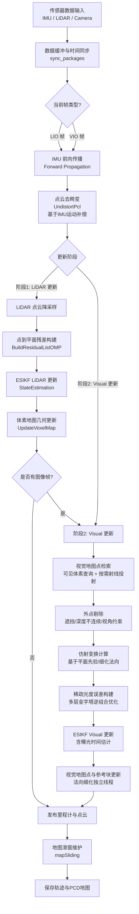
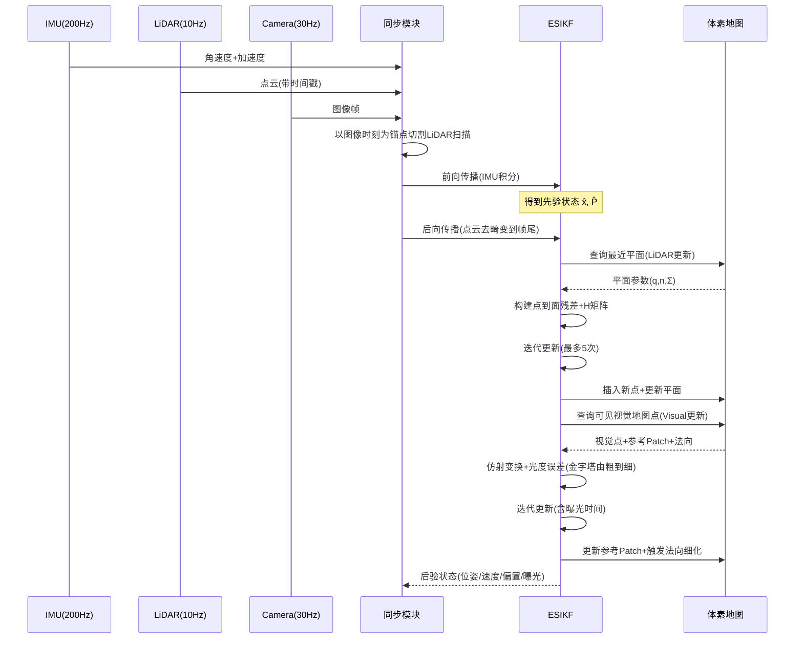

# FAST-LIVO2 深度解析：数据处理全流程与算法细节

> **论文**：FAST-LIVO2: Fast, Direct LiDAR-Inertial-Visual Odometry
> **作者**：Chunran Zheng, Wei Xu, Zuhao Zou 等（香港大学 MaRS 实验室）
> **发表**：arXiv:2408.14035 (2024年8月) / IEEE T-RO
> **代码**：https://github.com/hku-mars/FAST-LIVO2

---

## 一、论文核心思想翻译与概述

### 1.1 摘要翻译

本文提出 **FAST-LIVO2**：一种快速、直接的激光雷达-惯性-视觉里程计（LiDAR-Inertial-Visual Odometry, LIVO）框架，旨在 SLAM 任务中实现精确且鲁棒的状态估计，并为实时机载机器人应用提供巨大潜力。

FAST-LIVO2 通过**误差状态迭代卡尔曼滤波器（Error-State Iterated Kalman Filter, ESIKF）**高效融合 IMU、LiDAR 和图像测量数据。为解决异构 LiDAR 与图像测量之间的**维度不匹配问题**，在卡尔曼滤波器中采用**顺序更新策略（Sequential Update）**。

为提升效率，视觉与 LiDAR 融合均采用**直接法（Direct Method）**：
- **LiDAR 模块**：直接对原始点云进行配准，无需提取边缘或平面特征；
- **视觉模块**：通过最小化直接光度误差进行优化，无需提取 ORB 或 FAST 角点特征。

视觉与 LiDAR 测量的融合基于**单一统一体素地图（Unified Voxel Map）**：LiDAR 模块构建用于配准新扫描的几何结构，视觉模块将图像块（Patch）附加到 LiDAR 点上（即视觉地图点），从而实现新图像的对齐。

为提高图像对齐精度：
- 利用体素地图中 LiDAR 点提供的**平面先验（Plane Prior）**，甚至在对齐过程中**细化平面法向量**；
- 在新图像对齐后**动态更新参考块（Reference Patch）**。

为提高图像对齐鲁棒性：
- 采用**按需射线投射（On-demand Raycasting）**操作；
- **实时估计图像曝光时间（Exposure Time）**。

### 1.2 相对于 FAST-LIVO 的五大创新

| 序号 | 创新点 | FAST-LIVO 的做法 | FAST-LIVO2 的改进 |
|------|--------|-----------------|-------------------|
| 1 | ESIKF 顺序更新框架 | 异步更新（Asynchronous Update） | 顺序更新解决维度不匹配，提升鲁棒性 |
| 2 | 平面先验与法向细化 | 假设块内所有像素共享相同深度（过于简化） | 使用 LiDAR 平面先验，并通过光度一致性细化法向 |
| 3 | 参考块动态更新策略 | 按与当前视图的接近程度选择参考块（常选到低质量块） | 选择大视差、足够纹理的高质量内点参考块 |
| 4 | 在线曝光时间估计 | 未处理（光照变化大时收敛差） | 实时估计逆曝光时间，抵消光照变化 |
| 5 | 按需体素射线投射 | 未考虑 LiDAR 近距离盲区 | 无 LiDAR 点时按需射线投射，增强鲁棒性 |

---

## 二、系统总体架构

FAST-LIVO2 系统由四大核心模块组成：

```
┌─────────────────────────────────────────────────────────────────┐
│                    FAST-LIVO2 系统架构                           │
├─────────────┬───────────────────┬───────────────┬───────────────┤
│  传感器输入  │   ESIKF 状态估计   │  统一体素地图  │  测量模型      │
├─────────────┼───────────────────┼───────────────┼───────────────┤
│ IMU (200Hz) │  前向传播(预测)    │  几何结构层    │  LiDAR 测量模型 │
│ LiDAR(10Hz) │  后向传播(去畸变)  │  (平面+法向)   │  点到平面残差   │
│ Camera(30Hz)│  LiDAR 更新       │  视觉信息层    │  视觉测量模型   │
│             │  Visual 更新      │  (参考Patch)   │  稀疏光度误差   │
│             │  (顺序更新)        │               │               │
└─────────────┴───────────────────┴───────────────┴───────────────┘
```

**关键设计理念**：
1. **一套地图，多模态通用**：LiDAR 的几何与视觉的光度统一在同一结构中，避免跨图冗余与对齐误差积累；
2. **直接法一体化**：LiDAR 端点到面残差 + 视觉端光度误差，都基于同一体素地图构图与查询；
3. **服务顺序更新**：ESIKF 里先 LiDAR 更新再视觉更新，每次更新后地图及时注入新信息。

---

## 三、完整数据处理流程图

### 3.1 顶层流程图



### 3.2 单帧详细处理时序图



---

## 四、模块一：数据接收与时间同步

### 4.1 传感器数据缓冲

三种传感器数据分别进入独立的环形缓冲队列：
- `lid_raw_data_buffer`：LiDAR 原始点云（每帧带帧头时间戳）
- `imu_buffer`：IMU 测量（角速度、加速度、时间戳）
- `img_buffer` / `img_time_buffer`：图像数据与对应时间戳

### 4.2 时间同步核心逻辑（sync_packages）

**设计要点**：以**图像帧的拍摄时刻**为同步锚点，将 LiDAR 扫描切割对齐到该时刻。

**状态机切换**：
- `WAIT` / `VIO` → 准备 LIO 更新：取当前图像时刻 `img_capture_time = img_time_buffer.front() + exposure_time_init`
- `LIO` → 准备 VIO 更新：取出对应图像，切换为 VIO 状态

**LiDAR 扫描切割算法**：
```
对每个 LiDAR 帧:
  frame_header_time = 当前帧头时间
  max_offs_time_ms = (img_capture_time - frame_header_time) * 1000
  对帧内每个点 pt (其 curvature 字段存储相对帧头的时间偏移ms):
    if pt.curvature < max_offs_time_ms:
        → 归入当前帧 pcl_proc_cur (用于本次LIO更新)
        pt.curvature += (frame_header_time - last_lio_update_time) * 1000
    else:
        → 归入下一帧 pcl_proc_next (留给下次)
        pt.curvature += (frame_header_time - img_capture_time) * 1000
```

**关键点**：
1. 跨越图像时刻的 LiDAR 帧被**一分为二**，确保 LIO 更新精确对齐到图像曝光时刻；
2. `curvature` 字段被复用为**点的相对时间偏移**（ms），用于后续去畸变；
3. LIO 和 VIO 更新**交替进行**，均对齐到图像时刻，实现紧耦合。

---

## 五、模块二：IMU 预积分与状态传播

### 5.1 系统状态向量定义

ESIKF 的**名义状态（Nominal State）**为：

$$
\mathbf{x} = \begin{bmatrix}
^G\mathbf{R}_I & \text{（IMU姿态，3×3旋转矩阵）} \\
^G\mathbf{v}_I & \text{（IMU速度，3×1）} \\
^G\mathbf{p}_I & \text{（IMU位置，3×1）} \\
\mathbf{b}_g & \text{（陀螺仪零偏，3×1）} \\
\mathbf{b}_a & \text{（加速度计零偏，3×1）} \\
^G\mathbf{g} & \text{（重力向量，3×1）} \\
\tau & \text{（逆曝光时间，标量）}
\end{bmatrix}
$$

总维度 = 4（旋转用四元数存储）+ 3 + 3 + 3 + 3 + 3 + 1 = **20维名义状态**

**误差状态（Error State）** δx 维度 = 3（旋转扰动）+ 3 + 3 + 3 + 3 + 3 + 1 = **19维**

### 5.2 前向传播（Forward Propagation）

**目标**：从上一帧后验状态 $t_{k-1}$ 积分到当前帧时刻 $t_k$，得到先验分布。

**IMU 运动模型**：
$$
\begin{aligned}
^G\dot{\mathbf{R}}_I &= {}^G\mathbf{R}_I [\boldsymbol{\omega} - \mathbf{b}_g - \mathbf{n}_g]_\times \\
^G\dot{\mathbf{v}}_I &= {}^G\mathbf{R}_I (\mathbf{a} - \mathbf{b}_a - \mathbf{n}_a) + {}^G\mathbf{g} \\
^G\dot{\mathbf{p}}_I &= {}^G\mathbf{v}_I \\
\dot{\mathbf{b}}_g &= \mathbf{n}_{bg} \\
\dot{\mathbf{b}}_a &= \mathbf{n}_{ba}
\end{aligned}
$$

其中 $\boldsymbol{\omega}$、$\mathbf{a}$ 为 IMU 测量值，$\mathbf{n}_g, \mathbf{n}_a, \mathbf{n}_{bg}, \mathbf{n}_{ba}$ 为噪声。

**传播过程**：
1. 对 $t_{k-1}$ 到 $t_k$ 之间的每个 IMU 测量，设置过程噪声 $\mathbf{w}_i = 0$；
2. 数值积分（中值积分/欧拉积分）更新名义状态；
3. 同步传播误差状态协方差矩阵 $\mathbf{P}$（通过状态转移矩阵 $\mathbf{F}_i$ 和噪声雅可比 $\mathbf{W}_i$）：
$$
\mathbf{P}_{i+1} = \mathbf{F}_i \mathbf{P}_i \mathbf{F}_i^T + \mathbf{W}_i \mathbf{Q}_i \mathbf{W}_i^T
$$

**结果**：得到先验状态 $\hat{\mathbf{x}}$ 和先验协方差 $\hat{\mathbf{P}}$，作为后续更新的起点。

### 5.3 后向传播（Backward Propagation / 去畸变）

**目标**：将 LiDAR 扫描中不同时刻采集的点，统一变换到扫描结束时刻 $t_k$ 的坐标系下，消除运动畸变。

**算法**：
1. 从扫描结束时刻 $t_k$ 开始，**反向**遍历每个点的采集时刻 $t_j$；
2. 利用 IMU 测量反向积分，得到 $t_j$ 时刻相对于 $t_k$ 时刻的位姿变换 $^{I_k}\mathbf{T}_{I_j}$；
3. 将每个点从其采集时刻坐标系变换到帧尾坐标系：
$$
^{I_k}\mathbf{p}_j = {}^{I_k}\mathbf{R}_{I_j} \cdot {}^{I_j}\mathbf{p}_j + {}^{I_k}\mathbf{t}_{I_j}
$$

**意义**：去畸变后的点云可视为在同一时刻（帧尾）"测量"得到，保证后续点到平面配准的一致性。

---

## 六、模块三：LiDAR 测量模型与更新

### 6.1 LiDAR 点云降采样

对去畸变后的点云进行体素降采样（Voxel Downsampling），减少计算量同时保留几何结构。降采样后的点集记为 `feats_down_body_`。

### 6.2 点到平面残差构建（BuildResidualListOMP）

**核心思想**：直接法——不提取特征，将每个原始点与地图中最近的局部平面匹配，计算点到平面距离作为残差。

**步骤**：

1. **世界系变换**：利用当前迭代的状态估计（$^G\mathbf{R}_I, {}^G\mathbf{p}_I$），将体坐标系下的点变换到世界系：
$$
^G\hat{\mathbf{p}}_j = {}^G\hat{\mathbf{R}}_I \cdot {}^I\mathbf{R}_L \cdot {}^L\mathbf{p}_j + {}^G\hat{\mathbf{p}}_I + {}^I\mathbf{t}_L
$$

2. **体素查询**：根据世界系坐标，在哈希表中查找对应的根体素 → 子体素 → 叶体素（八叉树结构）。

3. **平面匹配**：若叶体素包含成熟平面（参数为中心点 $\mathbf{q}_j$、法向量 $\mathbf{n}_j$），则计算点到平面的有符号距离：
$$
r_j = \mathbf{n}_j^T ({}^G\mathbf{p}_j - \mathbf{q}_j)
$$

4. **并行计算**：使用 OpenMP 对所有点并行处理，有效匹配点存入 `ptpl_list_`。

### 6.3 观测雅可比矩阵 H 的推导

对状态扰动 $\delta\mathbf{x}$ 建立观测方程 $h(\mathbf{x}+\delta\mathbf{x}, \mathbf{0})$ 并一阶泰勒展开：

$$
h(\mathbf{x}+\delta\mathbf{x},\mathbf{0}) = \mathbf{n}_j^T \left( {}^G\mathbf{R}_I \exp(\delta^G\mathbf{r}_I) {}^I\mathbf{p}_j + {}^G\mathbf{t}_I + \delta^G\mathbf{t}_I - \mathbf{q}_j \right)
$$

利用罗德里格斯公式一阶展开 $\exp(\delta\mathbf{r}) \approx \mathbf{I} + [\delta\mathbf{r}]_\times$：

$$
{}^G\mathbf{R}_I \exp(\delta^G\mathbf{r}_I) {}^I\mathbf{p}_j \approx {}^G\mathbf{R}_I {}^I\mathbf{p}_j - {}^G\mathbf{R}_I [{}^I\mathbf{p}_j]_\times \delta^G\mathbf{r}_I
$$

最终得到观测系数矩阵（每个有效点一行）：

$$
\mathbf{H}_j = \mathbf{n}_j^T \left[ -{}^G\mathbf{R}_I [{}^I\mathbf{p}_j]_\times \quad \mathbf{I}_{3\times3} \quad \mathbf{0}_{3\times13} \right]
$$

其中：
- 前3列：对旋转扰动的雅可比（反对称矩阵形式）；
- 中间3列：对平移扰动的雅可比（即平面法向量）；
- 后13列：对速度、零偏、重力、曝光时间的雅可比为0（LiDAR残差不直接约束这些量）。

### 6.4 观测噪声协方差 R 的建模

观测噪声 $\mathbf{v}_l = (\delta^G\mathbf{p}_j, \delta\mathbf{n}_j, \delta\mathbf{q}_j)$ 包含三部分：
- $\delta^G\mathbf{p}_j$：LiDAR 点测量噪声（测距+方位角+光束发散角）；
- $\delta\mathbf{n}_j, \delta\mathbf{q}_j$：平面参数不确定性。

对观测方程 $h_l(\mathbf{x}, \mathbf{v}_l)$ 关于 $\mathbf{v}_l$ 求雅可比：
$$
\mathbf{J}_{v_l} = \left[ ({}^G\mathbf{p}_j - \mathbf{q}_j)^T \quad -\mathbf{n}_j^T \quad \mathbf{n}_j^T \right]
$$

观测协方差：
$$
\mathbf{R}_j = \mathbf{J}_{v_l} \begin{bmatrix} \boldsymbol{\Sigma}_{\mathbf{n}_j,\mathbf{q}_j} & \mathbf{0} \\ \mathbf{0} & \boldsymbol{\Sigma}_{^G\mathbf{p}_j} \end{bmatrix} \mathbf{J}_{v_l}^T
$$

**LiDAR 点不确定性各向异性建模**：
在 LiDAR 光束坐标系下（z轴沿测距方向）：
$$
\boldsymbol{\Sigma}_{\text{beam}}(R) = \begin{bmatrix} \sigma_t^2(R) & 0 & 0 \\ 0 & \sigma_t^2(R) & 0 \\ 0 & 0 & \sigma_r^2(R) \end{bmatrix}
$$
- $\sigma_r(R)$：径向测距噪声（mm级）；
- $\sigma_t(R)$：横向噪声，随距离 $R$ 线性增长（由光斑发散角引起），$\sigma_t(R) \approx \frac{D_{\text{spot}}(R)}{2\sqrt{3}}$。

世界系下：$\boldsymbol{\Sigma}_W = \mathbf{R}_{WL} \boldsymbol{\Sigma}_{\text{beam}} \mathbf{R}_{WL}^T$

残差权重：$w = \frac{1}{\mathbf{n}^T \boldsymbol{\Sigma}_W \mathbf{n} + \sigma_l}$，远距离/横向不确定大的点自动降权。

### 6.5 ESIKF LiDAR 更新（StateEstimation）

**迭代框架**（默认最多5次迭代）：

每次迭代：
1. 用当前状态重新变换点云到世界系；
2. 重新构建残差列表（匹配可能随状态更新而变化）；
3. 组装 $\mathbf{H}$ 矩阵（$N_{\text{eff}} \times 19$）和残差向量 $\mathbf{z}$；
4. 计算卡尔曼增益（使用信息矩阵形式 + Sherman-Morrison-Woodbury 公式加速）：
$$
\mathbf{K} = \left( \mathbf{H}^T \mathbf{R}^{-1} \mathbf{H} + \hat{\mathbf{P}}^{-1} \right)^{-1} \mathbf{H}^T \mathbf{R}^{-1}
$$
5. 更新状态：$\hat{\mathbf{x}} \leftarrow \hat{\mathbf{x}} \boxplus (-\mathbf{K}\mathbf{z})$；
6. 更新协方差：$\hat{\mathbf{P}} \leftarrow (\mathbf{I} - \mathbf{K}\mathbf{H})\hat{\mathbf{P}}$。

**迭代终止条件**：状态增量 $\|\delta\mathbf{x}\|$ 小于阈值，或达到最大迭代次数。

---

## 七、模块四：视觉测量模型与更新（核心重点）

> 本模块是 FAST-LIVO2 区别于 FAST-LIO2 的核心，也是用户特别关注的影像处理部分。以下进行极度详细的拆解。

### 7.1 视觉模块总览

**核心思想**：不提取 ORB/FAST 等特征点，**直接复用 LiDAR 地图点作为视觉地图点**，在当前帧与参考帧之间做稀疏图像块（Patch）光度对齐，最小化光度误差直接优化相机位姿和曝光时间。

**视觉更新在 ESIKF 顺序更新中是第二步**：在 LiDAR 更新得到的后验状态基础上，进一步用图像信息精修。

### 7.2 视觉地图点选择（Visual Map Point Selection）

#### 7.2.1 可见体素查询（Visible Voxel Query）

**目标**：快速筛选当前相机视锥内可能可见的地图点。

**方法**：
1. 利用当前 LiDAR 扫描击中的体素，快速筛选可能在相机视野内的地图点；
2. 结合上一帧可见的地图点所在体素，利用相邻帧视野重叠性提高召回率；
3. 得到初步视觉子地图（Visual Submap）。

**效率考量**：通过 LiDAR 点来识别当前图像中可见的视觉地图点，避免遍历全图。

#### 7.2.2 按需射线投射（On-demand Raycasting）

**动机**：LiDAR 存在**近距离盲区**（Near-field Blind Spot），且相机 FoV 与 LiDAR FoV 不完全重叠，导致部分图像区域没有对应的 LiDAR 地图点。

**算法**：
1. 将图像划分为 **30×30 像素网格**；
2. 对未被地图点覆盖的网格，取其中心像素；
3. 从相机光心沿该像素的射线方向，在深度范围 $[d_{\min}, d_{\max}]$ 内采样；
4. 查找射线穿过的体素，若包含地图点则加入视觉子地图；
5. 该操作**按需触发**（仅在网格无覆盖时执行），平衡效率与鲁棒性。

#### 7.2.3 外点剔除（Outlier Rejection）

对初步筛选的视觉地图点进行三重检验：

| 剔除类型 | 判断条件 | 目的 |
|---------|---------|------|
| **遮挡剔除** | 同一投影网格内只保留深度最近的点 | 去除被前景遮挡的点 |
| **深度不连续剔除** | 与当前 LiDAR 深度图比较，邻域深度差异过大则剔除 | 去除深度突变处的不可靠点 |
| **视角约束** | 参考Patch或当前Patch的视角与法向夹角 > 80° 则剔除 | 去除斜视严重、Patch畸变过大的点 |

### 7.3 仿射变换（Affine Warping）—— 影像处理核心之一

#### 7.3.1 为什么需要仿射变换

在直接法中，需要将参考帧的 Patch 变换到当前帧对应位置。由于相机运动和平面倾斜，Patch 不仅有平移，还有缩放、剪切等形变，必须用**仿射变换矩阵**来建模。

#### 7.3.2 基于平面先验的仿射变换公式

假设视觉地图点位于局部平面上，平面法向量为 $\mathbf{n}$，中心点为 $\mathbf{p}$。参考帧到目标帧的仿射变换为：

$$
\mathbf{u}_i^j = \mathbf{A}_r^i \mathbf{u}_r^j
$$

$$
\mathbf{A}_r^i = \mathbf{P} \left( {}^{I_i}\mathbf{R}_{I_r} + {}^{I_i}\mathbf{t}_{I_r} \frac{1}{{}^{I_r}\mathbf{n}^T \cdot {}^{I_r}\mathbf{p}} {}^{I_r}\mathbf{n}^T \right) \mathbf{P}^{-1}
$$

其中：
- $\mathbf{P}$：相机内参矩阵（支持针孔、鱼眼等多种模型，通过投影/反投影函数实现）；
- ${}^{I_i}\mathbf{R}_{I_r}, {}^{I_i}\mathbf{t}_{I_r}$：参考帧到目标帧的相对位姿；
- ${}^{I_r}\mathbf{n}$：参考帧相机系下的平面法向量（来自 LiDAR 平面先验）；
- ${}^{I_r}\mathbf{p}$：参考帧相机系下视觉地图点的3D坐标。

#### 7.3.3 三种仿射变换对比

| 方法 | 假设 | 精度 | 漂移(CBD/Office序列) |
|------|------|------|---------------------|
| **恒定深度**（Constant Depth） | Patch内所有像素共享同一深度 | 低 | 0.22m（无法回到起点） |
| **平面先验**（Plane Prior） | Patch位于LiDAR估计的局部平面上 | 中 | < 0.01m |
| **法向细化**（Plane Normal Refined） | 平面法向由光度一致性进一步优化 | 高 | < 0.01m，纹理最清晰 |

**实验结论**：平面先验相比恒定深度大幅提升精度；法向细化进一步增强纹理清晰度（地面文字、车道线、墙面图案等）。

### 7.4 法向量细化（Normal Refinement）—— 影像处理核心之二

#### 7.4.1 动机

仿射变换矩阵 $\mathbf{A}_r^i$ 的精度直接依赖于平面法向量 $\mathbf{n}$ 的精度。LiDAR 提供的法向可能存在噪声，通过多视角光度一致性可以进一步细化。

#### 7.4.2 优化问题

对参考帧相机系下的法向量进行优化：

$$
{}^{I_r}\mathbf{n}^* = \arg\min_{{}^{I_r}\mathbf{n} \in \mathbb{S}^2} \sum_{i \in S} \sum_{j=1}^{N^2} \left\| \tau_i I_i(\mathbf{A}_r^i \mathbf{u}_r^j) - \tau_r I_r(\mathbf{u}_r^j) \right\|_2
$$

即：在所有观测帧集合 $S$ 上，最小化参考 Patch 与各目标帧对应 Patch 的光度误差之和。

#### 7.4.3 重参数化与高效求解

为避免在球面 $\mathbb{S}^2$ 上的约束优化，引入中间变量：

$$
\mathbf{M} \triangleq \frac{1}{{}^{I_r}\mathbf{n}^T \cdot {}^{I_r}\mathbf{p}} {}^{I_r}\mathbf{n} \in \mathbb{R}^3
$$

约束条件：${}^{I_r}\mathbf{p} \cdot \mathbf{M} = 1$

将 $\mathbf{M}$ 参数化为无约束的2维变量 $\mathbf{m}$：

$$
\mathbf{M} = \mathbf{B}\mathbf{m} + \mathbf{b}, \quad
\mathbf{B} = \begin{bmatrix} 1 & 0 \\ 0 & 1 \\ -\frac{{}^{I_r}p_x}{{}^{I_r}p_z} & -\frac{{}^{I_r}p_y}{{}^{I_r}p_z} \end{bmatrix}, \quad
\mathbf{b} = \begin{bmatrix} 0 \\ 0 \\ \frac{1}{{}^{I_r}p_z} \end{bmatrix}, \quad
\mathbf{m} = \begin{bmatrix} M_x \\ M_y \end{bmatrix} \in \mathbb{R}^2
$$

求得最优 $\mathbf{m}^*$ 后恢复法向量：
$$
{}^{I_r}\mathbf{n}^* = \frac{\mathbf{M}^*}{\|\mathbf{M}^*\|}, \quad \mathbf{M}^* = \mathbf{B}\mathbf{m}^* + \mathbf{b}
$$

#### 7.4.4 执行策略

- **异步执行**：法向细化在**独立线程**中运行，不阻塞前端里程计的实时性；
- **触发条件**：仅对"参考块 + 多观测块"数量充足、且法向协方差较大（不确定）或光度残差显著的视觉点触发；
- **收敛固定**：一旦法向收敛，该视觉地图点的参考 Patch 和法向量固定，删除其他冗余 Patch；
- **失败回退**：若优化退化（条件数大、步长爆炸、有效像素过少），放弃更新并保留 LiDAR 先验。

### 7.5 参考块动态更新（Reference Patch Update）—— 影像处理核心之三

#### 7.5.1 动机

参考 Patch 的质量直接影响光度对齐精度。FAST-LIVO 按与当前视图的接近程度选择参考块，常选到低质量块。

#### 7.5.2 参考块评分函数

综合考虑**外观相似性**（NCC）和**视角质量**（正视程度），并按法向不确定度自适应加权：

**归一化互相关（NCC）**：
$$
\text{NCC}(f,g) = \frac{\sum_{x,y}[f(x,y)-\bar{f}][g(x,y)-\bar{g}]}{\sqrt{\sum_{x,y}[f(x,y)-\bar{f}]^2}\sqrt{\sum_{x,y}[g(x,y)-\bar{g}]^2}}
$$

**视角余弦**：
$$
c = \frac{\mathbf{n} \cdot \mathbf{p}}{\|\mathbf{p}\|}
$$
（越接近1表示越正视平面，Patch纹理分辨率越高）

**不确定度权重**：
$$
\psi_1 = \frac{1}{1 + e^{\text{tr}(\boldsymbol{\Sigma}_n)}}
$$
（法向越不确定，越依赖视角质量；越确定，越依赖外观相似性）

**综合评分**：
$$
S = (1-\psi_1) \cdot \frac{1}{n}\sum_{i=1}^{n}\text{NCC}(f, g_i) + \psi_1 \cdot c
$$

选择 $S$ 最高者作为参考块。

#### 7.5.3 Patch 金字塔结构

每个视觉地图点附着**三层同尺寸金字塔 Patch**（典型 11×11，逐层2倍下采样），用于由粗到细的光度对齐。

**新 Patch 添加触发条件**：
- 相邻两次添加跨越超过 **20帧**；或
- 像素位移超过 **40像素**。

以覆盖更多视角，增强光度对齐稳定性。

### 7.6 曝光时间估计（Exposure Time Estimation）—— 影像处理核心之四

#### 7.6.1 动机

环境光照变化会导致同一3D点在不同帧的灰度值不同，破坏光度一致性假设。FAST-LIVO 未处理此问题，光照变化大时收敛差。

#### 7.6.2 逆曝光时间模型

引入**逆曝光时间** $\tau$（状态向量的最后一维），光度一致性方程变为：

$$
\tau_k \cdot I_k(\mathbf{u}_i + \Delta\mathbf{u}) - \tau_r \cdot I_r(\mathbf{u}_i' + \mathbf{A}_i^r \Delta\mathbf{u}) = 0
$$

其中：
- $\tau_k, \tau_r$：当前帧与参考帧的逆曝光时间；
- 第一帧固定 $\tau_0 = 1$ 作为基准。

#### 7.6.3 在线估计

在 ESIKF 视觉更新中，$\tau$ 作为状态变量被同步估计：
- 雅可比中包含对 $\tau$ 的偏导（直接由光度方程求偏导）；
- 光照变化时，$\tau$ 自动调整以保持光度残差最小；
- 估计出的曝光时间还反馈给时间同步模块（`exposure_time_init`）。

### 7.7 稀疏直接光度误差构建—— 影像处理核心之五

#### 7.7.1 光度一致性假设

对于视觉地图点 ${}^G\mathbf{p}_i$，在真实位姿下，其在当前帧 $I_k$ 与参考帧 $I_r$ 的投影 Patch 满足：

$$
\tau_k \cdot I_k(\mathbf{u}_i + \Delta\mathbf{u}) - \tau_r \cdot I_r(\mathbf{u}_i' + \mathbf{A}_i^r \Delta\mathbf{u}) = 0
$$

其中 $\Delta\mathbf{u}$ 为 Patch 内相对中心的像素偏移（遍历 $N \times N$ 个像素）。

#### 7.7.2 逆组合公式（Inverse Compositional Formulation）

**核心技巧**：将位姿增量 $\delta\mathbf{T}$ 从当前帧投影位置 $\mathbf{u}_i$ 转移到参考帧位置 $\mathbf{u}_i'$。这样迭代优化时，**雅可比矩阵只需计算一次**（在参考帧上预计算），大幅减少计算量。

标准正向公式每步都要重新计算图像梯度和雅可比；逆组合公式将其移到参考帧预计算，迭代时只更新残差。

#### 7.7.3 多层金字塔优化

在**三层图像金字塔**上由粗到细逐层优化：

```
第0层(最粗, 1/4分辨率): 大范围收敛，提供初值
    ↓ 将结果作为下一层初值
第1层(1/2分辨率): 中等精度细化
    ↓
第2层(原图分辨率): 像素级精度对齐
```

每层迭代收敛后，将位姿和曝光时间的增量传递到下一层。

#### 7.7.4 残差与雅可比矩阵

**残差向量**：对每个视觉地图点的每个 Patch 像素，残差为：
$$
z_{i,j} = \tau_k \cdot I_k(\mathbf{u}_{i,j}) - \tau_r \cdot I_r(\mathbf{A}_r^k \mathbf{u}_{r,j})
$$

总残差维度 = 视觉点数 × Patch大小($N^2$)，通常可达数千维。

**状态变量**（视觉更新中被约束的量）：
- 当前帧位姿（6自由度：旋转3 + 平移3）；
- 逆曝光时间 $\tau$（1自由度）。

**雅可比推导**（链式法则）：
$$
\frac{\partial z}{\partial \delta\mathbf{x}} = \frac{\partial z}{\partial \mathbf{u}} \cdot \frac{\partial \mathbf{u}}{\partial \mathbf{p}} \cdot \frac{\partial \mathbf{p}}{\partial \delta\mathbf{x}} + \frac{\partial z}{\partial \tau}
$$

- $\frac{\partial z}{\partial \mathbf{u}}$：当前帧图像在投影位置的梯度（$\nabla I_k$）；
- $\frac{\partial \mathbf{u}}{\partial \mathbf{p}}$：相机投影模型的雅可比（针孔/鱼眼）；
- $\frac{\partial \mathbf{p}}{\partial \delta\mathbf{x}}$：3D点对位姿扰动的雅可比（同 LiDAR 部分的反对称矩阵形式）；
- $\frac{\partial z}{\partial \tau} = I_k(\mathbf{u}_{i,j})$：对曝光时间的雅可比。

### 7.8 ESIKF Visual 更新

在 LiDAR 更新后的后验状态基础上：

1. 构建视觉残差向量 $\mathbf{z}_c$ 和雅可比矩阵 $\mathbf{H}_c$；
2. 计算视觉观测噪声协方差 $\mathbf{R}_c$（基于图像梯度噪声、Patch纹理丰富度等）；
3. 卡尔曼增益：$\mathbf{K}_c = (\mathbf{H}_c^T \mathbf{R}_c^{-1} \mathbf{H}_c + \mathbf{P}_{\text{LiDAR后}}^{-1})^{-1} \mathbf{H}_c^T \mathbf{R}_c^{-1}$；
4. 状态更新：$\hat{\mathbf{x}} \leftarrow \hat{\mathbf{x}} \boxplus (-\mathbf{K}_c \mathbf{z}_c)$；
5. 协方差更新：$\mathbf{P} \leftarrow (\mathbf{I} - \mathbf{K}_c \mathbf{H}_c)\mathbf{P}$；
6. 迭代直至收敛（同样支持多层金字塔内的迭代）。

---

## 八、模块五：统一体素地图维护

### 8.1 地图数据结构

**哈希 + 八叉树混合结构**：
- **根体素**：固定 0.5m 立方体，由哈希表管理（键为体素坐标的哈希值）；
- **子体素**：每个根体素内部用八叉树自适应细化（最多3层），叶体素即局部平面；
- **可变叶体素尺度**：不同结构复杂度区域适配不同叶体素大小。

### 8.2 几何结构构建与更新（LiDAR 主导）

**新体素创建**：
1. LiDAR 更新后，将去畸变点云投到世界系，按坐标散入哈希根体素；
2. 对新体素内点做 **SVD 平面性检验**；
3. 若满足平面条件，估计平面参数（中心点 $\mathbf{q}$、法向量 $\mathbf{n}$、协方差 $\boldsymbol{\Sigma}_{n,q}$）；
4. 若不满足，细分为8个子体素，递归检验，直至满足或达到最大层数（3层）；
5. 达到最大层数仍不满足平面性的叶体素，丢弃其中的点。

**既有体素更新**：
1. 新增点并重检平面性；
2. 若破坏平面性则继续细分；
3. 否则更新平面参数 $(\mathbf{q}, \mathbf{n})$ 和协方差 $\boldsymbol{\Sigma}_{n,q}$；
4. 平面参数收敛后标记为**成熟平面**，后续新点被丢弃，参数固定。

### 8.3 视觉信息层维护

**视觉候选点池**：
- 成熟平面：仅保留最近的 **50个点**作为视觉点候选；
- 未成熟平面：全部点可为候选。

**视觉地图点生成条件**：
1. 从当前帧可见；
2. 在当前图像中具有**显著灰度梯度**；
3. 每个体素的局部平面上，仅保留"同一投影区域里深度最小"的候选（遮挡鲁棒性）；
4. 图像划分为 30×30 像素栅格，若某格尚无视觉点，以该格梯度最大的候选生成一个视觉点。

**视觉点附着信息**：
- 3D位置（来自 LiDAR 点）；
- 平面法向先验（来自体素平面）；
- 参考图像块金字塔（3层）；
- 多个观测块（用于法向细化和参考块选择）；
- 逆曝光时间（参考帧的）。

### 8.4 地图滑窗管理（mapSliding）

- 仅维护以当前 LiDAR 位置为中心、边长为 $L$ 的立方区域；
- 当探测范围触界时，整体"平移"地图窗口，复用移出区域的内存给新进入区域；
- 保证内存上限固定，适用于机载/嵌入式资源受限平台。

---

## 九、模块六：ESIKF 顺序更新数学框架

### 9.1 为什么需要顺序更新

LiDAR 测量（每帧数千个点到平面残差）和图像测量（每帧数千个光度残差）是**异构的**，数据维度不匹配。且图像测量可在金字塔各层分别融合。

标准 ESIKF 将所有测量堆叠在一起更新，但这要求两种测量的噪声统计独立且维度对齐，灵活性差。

### 9.2 顺序更新的理论等价性

将当前状态 $\mathbf{x}$ 的总条件分布重写为：

$$
p(\mathbf{x}|\mathbf{y}_l, \mathbf{y}_c) \propto p(\mathbf{x}, \mathbf{y}_l, \mathbf{y}_c) = p(\mathbf{y}_c|\mathbf{x}, \mathbf{y}_l) p(\mathbf{x}, \mathbf{y}_l) = p(\mathbf{y}_c|\mathbf{x}) \underbrace{p(\mathbf{y}_l|\mathbf{x}) p(\mathbf{x})}_{\propto p(\mathbf{x}|\mathbf{y}_l)}
$$

**关键假设**：给定状态 $\mathbf{x}$，LiDAR 测量 $\mathbf{y}_l$ 和图像测量 $\mathbf{y}_c$ 具有统计独立性（即被独立噪声破坏）。

在此假设下，顺序更新**理论上等价于**使用所有测量的标准联合更新，但提供了更大的灵活性：
- LiDAR 更新和 Visual 更新可以使用不同的迭代次数、收敛阈值；
- Visual 更新可以在金字塔各层独立执行；
- 某一模块失败时不影响另一模块。

### 9.3 完整更新流程

```
先验: x̂, P̂ (来自IMU前向传播)
  │
  ▼
[LiDAR 更新]
  ├── 构建点到平面残差 z_l, 雅可比 H_l, 协方差 R_l
  ├── 迭代更新: x̂ ← x̂ ⊞ (-K_l z_l), P ← (I-K_l H_l)P
  └── 得到后验1: x̂₁, P₁
  │
  ▼
[Visual 更新] (基于后验1)
  ├── 金字塔第0层(粗): 构建光度残差 z_c⁰, H_c⁰ → 更新
  ├── 金字塔第1层(中): 构建光度残差 z_c¹, H_c¹ → 更新
  ├── 金字塔第2层(细): 构建光度残差 z_c², H_c² → 更新
  └── 得到最终后验: x̂₂, P₂
```

---

## 十、步骤间配合与调整机制

### 10.1 模块间数据流

```
IMU高频数据 ──→ 前向传播 ──→ 先验状态 x̂,P̂
                    │
                    ▼
              后向传播(去畸变)
                    │
                    ▼
LiDAR点云 ──→ 降采样 ──→ 点到平面残差 ──→ ESIKF更新1 ──→ 后验1
                    │                              │
                    │                              ▼
                    │                        体素地图几何更新
                    │                              │
                    │                              ▼
Camera图像 ──→ 视觉点检索(查地图) ──→ 光度残差 ──→ ESIKF更新2 ──→ 最终后验
                    │                              │
                    │                              ▼
                    │                        视觉地图点/Patch更新
                    │                              │
                    └──────────────────────────────┘
                           (法向细化独立线程)
```

### 10.2 关键配合机制

| 配合点 | LiDAR 模块 | Visual 模块 | 配合方式 |
|--------|-----------|-------------|---------|
| **地图共享** | 构建几何平面 | 附加视觉Patch | 同一体素地图，LiDAR点即视觉点 |
| **状态传递** | 输出后验1 | 以后验1为先验 | 顺序更新，逐级精修 |
| **平面先验** | 估计法向n | 用于仿射变换 | LiDAR几何先验喂给视觉扭曲 |
| **法向细化** | 提供初始法向 | 光度一致性优化 | 视觉反哺几何，信息闭环 |
| **时间同步** | 扫描切割到图像时刻 | 以图像时刻为锚 | 两者对齐到同一时刻 |
| **退化自适应** | 检测几何退化 | 调整视觉帧选择 | LiDAR退化时增加视觉约束权重 |

### 10.3 LiDAR 退化检测与自适应

**退化检测方法**：
1. 从当前 LiDAR 扫描提取平面法向集合；
2. 计算 $\mathbf{n}_{\text{est}} \mathbf{n}_{\text{est}}^T$ 的 SVD；
3. 归一化奇异值 $[\tilde{\sigma}_{\min}, \tilde{\sigma}_{\text{mid}}, \tilde{\sigma}_{\max}]$；
4. 若 $\tilde{\sigma}_{\min}$ 连续多帧低于阈值（如0.07），判定为退化。

**自适应策略**：
- **退化时**（如隧道、长廊）：使用所有可用图像，最大化视觉约束；
- **正常时**：按位姿变化阈值选取关键帧，减少计算；
- 阈值自适应缩放：$\tau = \sqrt{3} \cdot \tilde{\sigma}_{\min} \cdot \tau_{\text{predefined}}$。

### 10.4 迭代与收敛的协调

- LiDAR 更新默认最多 **5次迭代**（点到平面匹配非线性较强）；
- Visual 更新在每层金字塔内迭代，三层由粗到细；
- 两者共享同一状态向量，LiDAR 先收敛到几何一致，Visual 再精修到光度一致；
- 若 LiDAR 更新后有效点数过少（几何约束不足），Visual 更新的权重自动增大。

---

## 十一、最终建图与应用

### 11.1 建图输出

FAST-LIVO2 最终输出**密集彩色点云地图**：
- **几何结构**：由 LiDAR 点云构建，体素地图中所有平面的点集合；
- **颜色信息**：由视觉模块将图像颜色投影到对应 LiDAR 点上；
- **精度**：像素级对齐精度，地面文字、车道线、墙面图案清晰可辨。

### 11.2 建图流程

```
每帧处理完成后:
  1. 将当前帧去畸变点云用最终位姿变换到世界系
  2. 插入体素地图（UpdateVoxelMap）
  3. 将当前图像颜色投影到可见的LiDAR点上（着色）
  4. 地图滑窗维护（mapSliding）
  5. 可选: 保存PCD文件
```

### 11.3 三大应用场景

| 应用 | 展示能力 | 说明 |
|------|---------|------|
| **无人机机载导航** | 实时计算效率 | 在机载ARM平台上实时运行，延迟低 |
| **航空测绘** | 高精度建图 | 大场景下密集点云精度高，漂移小 |
| **3D模型渲染** | 地图适用性 | 重建的密集地图可直接用于Mesh渲染和NeRF渲染 |

---

## 十二、与相关算法的对比

### 12.1 与 FAST-LIO2 的对比

| 维度 | FAST-LIO2 | FAST-LIVO2 |
|------|-----------|------------|
| 传感器 | LiDAR + IMU | LiDAR + IMU + Camera |
| 地图 | 体素几何地图 | 统一体素地图(几何+视觉) |
| 视觉 | 无 | 稀疏直接光度法 |
| 退化场景 | 隧道/长廊可能漂移 | 视觉约束补充，更鲁棒 |
| 地图颜色 | 无 | 彩色点云 |

### 12.2 与 FAST-LIVO 的对比

| 维度 | FAST-LIVO | FAST-LIVO2 |
|------|-----------|------------|
| 融合方式 | 异步更新 | 顺序更新ESIKF |
| 仿射变换 | 恒定深度假设 | 平面先验+法向细化 |
| 参考块 | 按接近度选择 | NCC+视角评分动态选择 |
| 曝光时间 | 不估计 | 在线估计逆曝光时间 |
| 盲区处理 | 不考虑 | 按需射线投射 |

### 12.3 与 R3LIVE / LVI-SAM 的对比

| 维度 | R3LIVE / LVI-SAM | FAST-LIVO2 |
|------|-----------------|------------|
| 视觉前端 | 特征点(ORB/FAST) | 直接法(光度误差) |
| LiDAR前端 | 特征提取(边缘/平面) | 直接法(原始点云) |
| 地图结构 | 双地图(LiDAR图+视觉图) | 单一体素地图 |
| 计算效率 | 较低(特征提取耗时) | 高(直接法+统一地图) |
| 低纹理场景 | 特征不足可能失败 | 直接法更鲁棒 |

---

## 十三、关键参数速查表

| 参数 | 典型值 | 说明 |
|------|--------|------|
| 根体素大小 | 0.5 m | 哈希表管理的根体素边长 |
| 八叉树最大层数 | 3层 | 体素自适应细分深度 |
| 视觉网格大小 | 30×30 px | 图像均匀化分块 |
| Patch大小 | 11×11 px | 视觉对齐的图像块尺寸 |
| 金字塔层数 | 3层 | 由粗到细光度对齐 |
| LiDAR最大迭代 | 5次 | ESIKF LiDAR更新迭代次数 |
| 成熟平面候选点 | 50个 | 成熟平面保留的视觉候选点数 |
| 新Patch触发帧数 | 20帧 | 超过此帧数添加新观测块 |
| 新Patch触发位移 | 40 px | 超过此像素位移添加新观测块 |
| 视角剔除阈值 | 80° | 视角与法向夹角超过则剔除 |
| 退化阈值 | 0.07 | 最小奇异值低于此值判定退化 |

---

## 参考文献

1. Zheng C, Xu W, Zou Z, et al. FAST-LIVO2: Fast, Direct LiDAR-Inertial-Visual Odometry. arXiv:2408.14035, 2024.
2. Xu W, Cai Y, He D, et al. FAST-LIO2: Fast Direct LiDAR-Inertial Odometry. IEEE T-RO, 2022.
3. Zheng C, Xu W, et al. FAST-LIVO: Fast and Tightly-coupled Sparse-Direct LiDAR-Inertial-Visual Odometry. ICRA, 2022.
4. 代码仓库: https://github.com/hku-mars/FAST-LIVO2
